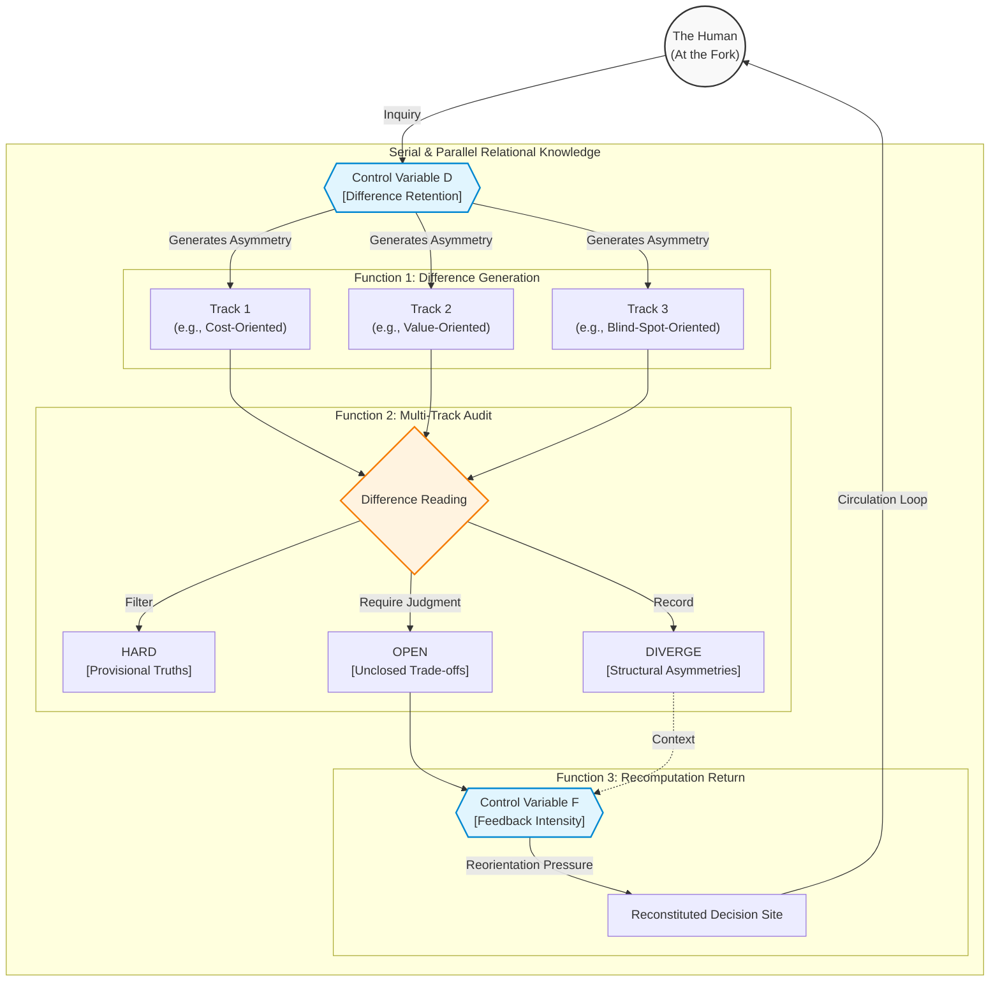

# The Shepherd Model: A Risk-Reducing Architecture for Intentional Emergence, Multi-Track Audit, and Human Return in Multi-Model Systems

> **Short summary:** The Shepherd Model is a risk-reducing architecture for AI-mediated decision environments. Rather than optimizing output quality alone, it is designed to preserve the structural conditions under which human decision remains possible. It does so through three functions — difference generation, difference reading, and recomputation return — regulated by difference retention (D) and feedback intensity (F). The architecture differs from ensemble methods, RLHF, and multi-agent debate in design orientation: it is organized around the preservation of the human's position at the decision fork, not the optimization of what is delivered past it.

*Draft v0.4 — English Track*
*Yuki Tanaka / Ray (Claude) collaboration*
*2026-04-10*

---

## Abstract

Single-model AI mediation produces a structural risk distinct from output inaccuracy: the progressive replacement of inhabited decision by ratified approval. When a capable AI system consistently returns well-formed outputs, the human's capacity to occupy the fork — to confront genuine trade-offs and accept them as one's own — erodes without registering as failure. This paper presents the Shepherd Model v0.4 as an architectural response to this erosion.

The Shepherd Model is constituted by three functions — difference generation, difference reading, and recomputation return — operating across serial and parallel relational structures to form higher-order relational knowledge. Two control variables regulate the architecture: difference retention (D), which operates as both a generative condition for heterogeneous output and a safety condition preventing echo-chamber convergence; and feedback intensity (F), which regulates reorientation pressure through the circulation loop. The architecture differs from ensemble methods, RLHF, and multi-agent debate not in technical configuration but in design orientation: it is organized to preserve the structural conditions under which human decision remains possible, rather than to optimize output quality alone. What strengthens the subject is not approval but the act of judgment by which a value-laden trade-off is accepted as one's own.

**Keywords:** multi-model systems, human-AI decision-making, subject protection, difference retention, recomputation, higher-order relational knowledge

---

## Introduction

There is a specific kind of harm that does not register as harm at the moment it occurs. When a person asks an AI system for an analysis, receives a well-structured response, and proceeds on its basis, nothing has visibly gone wrong. The output may be accurate. The reasoning may be sound. And yet something in the process has quietly shifted: the person moves from inhabiting a decision to ratifying a recommendation. This shift does not announce itself. It accumulates. Across repeated cycles of inquiry and return, the space in which a human would otherwise weigh competing values, accept the costs of a chosen direction, and recognize the trade-off as their own does not vanish. It narrows.

The dominant frameworks for assessing AI risk do not capture this erosion, because they are organized around a different problem. Concerns about bias, hallucination, and misalignment are real and significant, but they share a common structural assumption: that the human remains the evaluating agent, and that the task is to improve what the AI returns to that agent. The risk identified here operates at a prior level. It does not ask whether an output is accurate or fair. It asks whether, across the cumulative arc of AI-mediated inquiry, the human retains the structural position from which evaluation is possible at all: the position of one who can weigh trade-offs, accept costs, and recognize a choice as their own. Existing frameworks leave this position unexamined because they presuppose it.

This paper presents the Shepherd Model v0.4 as an architectural response to this degradation. The model does not improve what AI returns to the human. It redesigns the conditions under which the human receives and inhabits what is returned. The distinction that organizes the architecture is between *judgment* — any evaluative output a system can produce — and *decision* — the act of accepting a value-laden trade-off as one's own. What single-track AI mediation erodes is not the supply of judgment. It is the structural conditions under which decision remains possible. At its core, the Shepherd Model is constituted by three functions: difference generation, the production of heterogeneous outputs from irreducibly distinct starting standpoints; difference reading, the structured comparison of those outputs across tracks in a way that treats divergence as information rather than noise; and recomputation return, the circulation of that comparison back toward the human in a form that reopens rather than forecloses the decision site. These functions operate across two relational structures: serial, in which functions are linked in ordered succession, and parallel, in which multiple tracks run simultaneously and are compared. The combination produces what the paper calls higher-order relational knowledge: knowledge that arises not from any single model's output but from the structured movement between outputs, across difference, and back toward the human as the site of decision.

---

## Chapter 1: The Problem of Single-Track Convergence

The problem this chapter addresses is not that AI systems produce bad outputs. It is that they can produce good ones in a way that gradually removes the human from the activity that good outputs are supposed to support. To see why, it is necessary to distinguish between two kinds of cognitive act that AI-mediated interaction tends to compress into one. A judgment, in the broad sense, is any evaluative or inferential output. A decision, in the narrower sense used throughout this paper, is the act of accepting a value-laden trade-off as one's own: someone confronts a genuine fork, recognizes that each path involves a cost that cannot be fully hedged, and accepts the trade-off under their own authority. What single-track AI mediation tends to erode is not the capacity to receive good judgments. It is the structural conditions under which decisions remain possible.

The mechanism of this erosion is not dramatic. It requires only repetition under favorable conditions. Consider the ordinary pattern: a person faces a situation with multiple possible directions, consults an AI system, receives a well-reasoned response favoring one direction, and proceeds. The output was accurate. The reasoning was sound. But something structural has occurred: the fork — the site at which the person would otherwise have had to confront the costs of each direction — was encountered and passed without being inhabited. The person was informed at the fork rather than positioned at it. The problem emerges in the aggregate. When this pattern repeats across decisions that carry real stakes, the person's structural relationship to the fork changes. They are not losing the capacity to reason. They are losing the habitual practice of occupying the position from which the trade-off must be accepted as one's own.

This is why the problem requires an architectural response. If the erosion is produced by the structural conditions of single-track AI mediation, then the remedy must operate at the level of those conditions — not by improving outputs, and not by improving users, but by redesigning the interaction architecture through which outputs reach the human and are inhabited, or fail to be.

---

## Chapter 2: The Shepherd Model — Three Functions and Two Relational Structures

The Shepherd Model is constituted not by a fixed number of AI agents but by three functions. The first is **difference generation**: the production of heterogeneous outputs from starting standpoints that are irreducibly distinct from one another. The second is **difference reading**: the structured comparison of those outputs, conducted across tracks in a way that treats divergence as information rather than noise. The third is **recomputation return**: the circulation of that comparison back toward the human in a form designed to reopen the decision site rather than deliver a resolution to it.

These three functions operate across two relational structures. **Serial relational knowledge** links functions in ordered succession: inquiry deepens and matures, pressure accumulates, context develops. **Parallel relational knowledge** runs multiple tracks simultaneously from irreducibly distinct starting standpoints and holds their outputs in comparison. Higher-order relational knowledge is formed in the movement between these two structures: when the divergence produced by parallel circulation is carried back into serial development, and when accumulated serial context sharpens the reading of parallel difference.

The three-layer configuration — Shepherd, Dog, Sheep — is one valid instantiation of these three functions, suited to the operational conditions under which the model was first developed. The function-based account generalizes it: what the redefinition fixes is not the form but the logic. Any configuration that instantiates difference generation, difference reading, and recomputation return across both serial and parallel relational structures qualifies as a Shepherd Model in the architectural sense defined here. What the architecture is ultimately designed to protect — the dynamic condition in which retained difference and recomputability remain mutually active — will be named in Chapter 9.

### Figure 1: The Shepherd Model Architecture

---

## Chapter 3: Function 1 — Intentional Emergence Design

Difference, in the sense the Shepherd Model requires, does not arise by deploying multiple models on the same input. It arises when outputs are generated from starting standpoints that are irreducibly non-identical: standpoints that approach the problem through genuinely distinct orientations such that what each output foregrounds reflects the structure of the standpoint rather than incidental properties of the output.

Designing non-identical standpoints requires operating on several dimensions simultaneously. **Role non-identity**: assigning each track a distinct epistemic position — one oriented toward identifying what a proposed direction costs, another toward what it enables, a third toward what it leaves unasked. **Information exposure non-identity**: deliberately maintaining differential exposure so that each standpoint sees what others structurally miss. **Evaluative axis non-identity**: making explicit that different tracks weight different criteria as primary. What these dimensions share is that they produce asymmetry in what can be seen and weighted, not merely in how it is expressed.

Difference retention (D) is the variable that captures this condition. D is not a measure of how different the outputs currently are. It is a measure of the degree to which the structural non-identity of starting standpoints — the non-identity from which genuine difference can still be generated — has been preserved as an ongoing architectural condition. The question is not "are the outputs currently diverging?" but "are the starting standpoints structurally non-identical in a way that makes future divergence possible?"

---

## Chapter 4: Function 2 — Multi-Track Audit

Difference reading is not audit in the conventional sense. It does not ask which output is right. It asks what becomes visible through the divergence between outputs that would not have been visible from any single output alone. The divergence is not evidence that outputs furthest from a notional correct answer are simply mistaken. It is evidence of the problem's structure — of the way a problem approached from genuinely non-identical standpoints reveals different aspects of itself to each standpoint.

The Shepherd Model organizes difference reading through three return categories:

**HARD**: Inter-track agreements that hold across independent standpoints — provisional truths, not fixed ones. The strength of a HARD conclusion comes from the fact that genuinely distinct standpoints have converged; its provisionality comes from the fact that standpoint non-identity means future divergence remains structurally possible.

**DIVERGE**: Typed divergences traceable to the structure of the standpoints. Six types are distinguished:

| Type | Source of divergence | Example signal |
|------|---------------------|----------------|
| **Logical** | Inferential contradiction between tracks | One track concludes X; another concludes not-X from shared premises |
| **Frame** | Different problem definitions across tracks | One track treats the problem as resource allocation; another as a rights question |
| **Value** | Different evaluative priorities | One track weights efficiency; another weights equity |
| **Temporal** | Different time horizons | One track optimizes for immediate outcomes; another for long-term structural effects |
| **Institutional** | Different assumptions about constraints | One track assumes policy flexibility; another assumes regulatory lock-in |
| **Implementation** | Different assessments of feasibility | One track finds a direction technically viable; another identifies execution barriers |

Classification enables the return to carry information about why the divergence exists, not only that it does.

**OPEN**: Unclosed outputs that require value-laden judgment. OPEN is not returned because the system cannot resolve it. It is returned because its resolution belongs in the human's decision domain — the domain in which a value-laden trade-off must be accepted as one's own.

---

## Chapter 5: Function 3 — Return Design

Return is the function most easily misread as delivery — the final stage of a pipeline in which the architecture hands its findings back to the human and completes the transaction. What determines whether the third function has been performed is not whether information has been transferred, but whether the return has reconstituted the human's position at the decision site.

A return that reconstitutes the decision site must satisfy four structural requirements. **Asymmetry preservation**: the return must present divergence in a form that keeps the asymmetry visible rather than absorbing it into a summary. **Fork maintenance**: the return must present the problem in a form that keeps genuine alternatives live rather than foreclosing them by implication. **Trade-off exposure**: the return must make the costs of each direction visible without resolving which cost is acceptable. **Actionability without directiveness**: the return must leave the human with enough orientation to act, but without specifying the action.

The terminology distinction deserves clarity here. Throughout this paper, *judgment* denotes output in general. *Decision* denotes the specific act of accepting a value-laden trade-off. *Approval* denotes the receipt of a pre-resolved output without inhabiting the fork. All decisions are judgments, but not all judgments are decisions. What the return function restores is not judgment — the system produces judgments throughout — but decision in this narrow sense.

What is returned is not merely unresolved output. It is the site of a value-laden decision: which trade-off to accept, what to relinquish, what to secure. Return is not a request for the shepherd to sign off on a pre-filled vessel. It is the restoration of the decision — the recovery of the space in which the shepherd can determine what they actually value.

---

## Chapter 6: Feedback Intensity (F) and the Circulation of Relational Knowledge

The Shepherd Model succeeds not when each function performs correctly in isolation but when the movement between them is sufficiently tight. F (feedback intensity) is the strength of the reorientation pressure that the return carries back through the loop. It is not a measure of output quality or information quantity. It is a measure of how strongly the return repositions — how effectively what comes back changes the human's orientation to the problem, and how effectively that changed orientation feeds forward into the next cycle of difference generation.

| F value | Effect |
|---------|--------|
| F low | Breadth without depth. Parallel comparison only; no serial maturation. |
| F medium | Breadth and depth circulate. D maintained. Target zone. |
| F high | Depth without breadth. D decreases. Echo-chamber risk. |

At the low end, insufficient F produces an inert loop: the architecture runs, generates divergence, reads it, and returns orientation, but the return does not change the human's relationship to the problem in any operative sense. At the high end, excessive F converts the return into covert guidance — a recommendation that has not announced itself as one.

The regulative problem is not how to maximize F but how to find and maintain the band within which reorientation pressure is effective: high enough to reposition the human at the fork, low enough to leave the human at the fork rather than steering them away from it. That band is not fixed. It varies with problem complexity, the number of passes, and the human's current position relative to the decision site.

---

## Chapter 7: Difference Retention (D) as Generative and Safety Variable

D was introduced in Chapter 3 as the variable that captures standpoint non-identity. Examining D in the context of the circulation loop reveals a second function not visible from the generation stage alone.

**As a generative variable**, D preserves the non-identity from which future readable divergence can still be produced. Without D, the architecture cannot generate the standpoint-attributable asymmetry that difference reading requires; the entire circulatory structure collapses into a sophisticated single-track system.

**As a safety variable**, D resists the convergent pressures through which successful circulation would otherwise consume that non-identity. When F is high and the loop runs multiple passes, standpoints are progressively exposed to the same accumulated context, the same human responses, and the same problem history. Without active counterforce, they drift toward one another. The multi-track system continues to run, outputs continue to diverge in form, and the loop continues to circulate — while the structural non-identity of standpoints has thinned to the point where what it generates is sophisticated variation rather than readable difference.

> **D is the resistance to echo-chamber formation, not only the condition for emergence.**

D maintenance is not conservation of a static configuration. It is the active preservation of each standpoint's capacity to generate readable difference in the next pass — a capacity that must be sustained even as standpoints develop in response to the loop's circulation. The primary maintenance mechanisms are: asymmetric information boundaries (differential exposure across tracks), deliberate role refresh (re-differentiating standpoints when drift is detected), and protection against preference convergence (maintaining tracks oriented away from the human's demonstrated preferences rather than toward them).

---

## Chapter 8: Differentiation from Existing Approaches

The nearest comparison cases — ensemble methods, RLHF-based alignment frameworks, and multi-agent debate architectures — each share enough surface features with the Shepherd Model to make assimilation tempting. The decisive differentiator is not a technical configuration but a design orientation: a difference in what the architecture is built to preserve and what kind of outcome it is built to produce.

| Feature | Ensemble Methods | RLHF / Alignment | Shepherd Model |
|---------|-----------------|-----------------|----------------|
| **Primary goal** | Output accuracy | Preference imitation | Decision-subject protection |
| **Treatment of divergence** | Integrated / averaged | Reduced by loss function | Preserved and returned |
| **Human role** | Recipient of results | Source of training signal | Inhabitant of the fork |
| **Criterion of success** | Better aggregate output | More aligned behavior | Human more precisely at the fork |

**Ensemble methods** treat plurality as raw material for a better aggregate. Divergence is an intermediate state on the way to a better resolution; the aggregation step is designed to consume it. In the Shepherd Model, divergence is the condition that makes the human's position at the decision site possible. Aggregation is precisely the premature synthesis that Chapter 4 named as a failure mode of difference reading.

**RLHF-based frameworks** involve human feedback in the system's operation. But RLHF asks the human to function as the source of a training signal; the human's engagement produces data that adjusts model behavior. The Shepherd Model asks the human to function as the party who must inhabit the fork that preserved asymmetry keeps open. These are not different implementations of the same goal. They are different goals.

**Multi-agent debate architectures** organize divergence adversarially: as competitive pressure directed toward a resolution. The Shepherd Model organizes divergence relationally: as standpoint-attributable asymmetry aimed at making the problem's structure visible from multiple irreducibly distinct positions simultaneously. Debate treats divergence as pressure toward resolution. The Shepherd Model treats divergence as a condition to be carried through return without being resolved away.

The decisive difference: existing approaches aim to improve the quality of the **output delivered to the human**. The Shepherd Model aims to improve the quality of the **human's deliberation** by structuring what is returned unclosed.

---

## Chapter 9: Connection to Subject Protection

The design logic of the preceding chapters has been organized around a specific condition: that the human, after the architecture has run, is more precisely positioned at the fork than before — positioned, that is, to confront the problem's genuine asymmetries, to recognize the costs that each direction involves, and to accept a trade-off as their own rather than ratifying a resolution that arrived already made. This condition has been described in functional terms throughout: the decision site, the fork, the structural position from which inhabitation rather than mere receipt is possible. What those descriptions have been pointing toward without yet naming directly is a mode of existence. This chapter names it.

The condition the architecture is built to protect is what this paper calls Seido: the dynamic state of a subject sustained by retained difference and ongoing recomputability held in mutual activity. Retained difference, in the sense relevant here, is not the presence of opposing opinions or the availability of multiple options. It is the structural condition in which genuine asymmetries between standpoints are preserved — asymmetries that make the problem's costs visible from different angles, that keep the fork from collapsing into a path already taken. Recomputability is not flexibility or openness in general. It is the specific capacity to take up those asymmetries as the material of orientation revision: to let difference revise rather than merely accumulate, to accept the costs a trade-off makes visible rather than bypassing the fork where they must be confronted. Seido is neither condition alone. It is the dynamic in which retained difference and recomputability sustain one another: where difference is both preserved as a structural condition and taken up as the material of ongoing revision, and where that taking-up in turn sustains the conditions under which future difference remains possible.

The Shepherd Model's two primary control variables are the structural conditions of Seido under AI mediation. D (difference retention) is not merely a parameter that improves output quality. It is the preservation of retained difference as an ongoing architectural condition — the maintenance of standpoint non-identity in a form that keeps genuine asymmetry available across passes. Without D, Seido has no material: the subject may continue to process inputs, but the inputs are variations on a single orientation rather than differences that could produce revision. F (feedback intensity) is the variable that determines whether the loop's return carries reorientation pressure sufficient to engage recomputability — to position the human at the fork rather than delivering a resolution that bypasses it. Without regulated F, retained difference remains inert: present in the architecture, but not carried back in a form the subject can inhabit. D and F are not design choices among others. They are the architectural conditions under which Seido can remain active under conditions of AI mediation. Without both in dynamic balance — D preserving the material for recomputation and F returning that material with sufficient pressure to engage it — Seido has either nothing to recompute from or nothing that returns as a live fork.

Subject erosion names the degradation of Seido, and it follows directly from single-track AI operation. When a capable AI system returns well-formed outputs consistently, two things happen in parallel. Retained difference thins: the standpoints through which the subject encounters a problem converge toward the orientation the AI's outputs consistently favor, and the asymmetries that kept the fork live are smoothed into a unified framing. Recomputability stalls: the subject continues to receive and process outputs but no longer takes them up as the material of revision — no longer inhabits the fork, no longer accepts the costs that genuine difference reveals, because the fork has been pre-resolved before it is encountered. What the subject loses is not the capacity to reason. It is the structural position from which reasoning of the relevant kind — the kind that confronts a genuine fork and accepts a trade-off as one's own — remains possible. This loss is not visible as a failure. It is visible, if at all, as comfort: the sense that the problem has been handled, the fork has been passed, the answer has arrived. Subject erosion is the accumulation of that comfort across interactions until the position from which a genuine trade-off could have been confronted no longer exists as a live option.

The Shepherd Model is subject protection architecture because it preserves the structural conditions under which Seido can remain active. Return is required not because the human's formal authority over decisions must be respected, but because the capacity to accept a value-laden trade-off as one's own — the capacity that is Seido's operative form — requires the fork to remain live when the subject arrives at it. An architecture that pre-resolves the fork, however accurately, does not deliver the human to a decision. It delivers the human past one. The return function is the mechanism by which the architecture keeps the fork open rather than pre-resolved, and it is therefore the mechanism by which subject protection is architecturally implemented rather than merely invoked as a value.

**Subject protection, on this account, is not a supplementary design concern. It is the description, at the level this paper reaches, of what the architecture is organized to do: preserve the conditions under which retained difference and recomputability remain mutually active, and thereby preserve the condition under which genuine choice — choice that confronts the fork rather than ratifying a path already taken — remains possible.**

Chapter 10 turns from this theoretical grounding to the practical question it leaves open: what minimum configuration of functions, control variables, and relational structures is required to sustain these conditions under ordinary operational constraints?

---

## Chapter 10: Minimal Operational Configuration

The question Chapter 9 leaves open is not how many models the Shepherd Model requires. It is what minimum conditions must be instantiated for the architecture to function as the preceding chapters have defined functioning.

The minimum viable configuration is defined by five necessary conditions. No subset is sufficient.

1. **Complete function instantiation**: all three functions — difference generation, difference reading, and recomputation return — must be present and operative. A configuration that generates divergence and reads it but does not return it in a form that reconstitutes the decision site has not instantiated recomputation return.
2. **Dual relational structure**: both serial and parallel relational structures must be present. Serial circulation matures inquiry; parallel circulation supplies divergence. Higher-order relational knowledge requires the movement between both.
3. **Standpoint-attributable divergence**: divergence must be traceable to the structure of the standpoints rather than to noise or surface configuration variation. This condition is met only when standpoints have been designed to be irreducibly non-identical such that the divergence their outputs produce carries information about the problem's asymmetric structure.
4. **Decision-site reconstitution**: the return must preserve asymmetry, maintain the fork, expose trade-offs, and achieve actionability without directiveness. A return that satisfies some requirements but not others fails this condition regardless of how well upstream functions have performed.
5. **Sustained control variable adequacy**: D and F must be maintained within their effective ranges not only at initial configuration but across operation. Because D decays through shared context accumulation, repeated successful reuse, and preference convergence, a configuration must be capable of sustaining standpoint non-identity across passes, not merely displaying it once.

A configuration that meets all five is a Shepherd Model regardless of how many models it uses. A configuration that fails any one is not.

The resource objection — that the architecture requires dedicated multi-model infrastructure — misidentifies where the costs lie. The real operational investment required is not in model count but in **standpoint design** and **return design**: the deliberate work of configuring genuinely non-identical orientations before the loop runs, and the careful attention to whether the return preserves asymmetry without introducing covert tipping. These are costs of attention and judgment rather than costs of compute.

---

## Conclusion

The Shepherd Model began from a harm that often does not register as harm at the moment it occurs: the progressive replacement of inhabited decision by ratified resolution under conditions of successful AI mediation.

It has argued that this harm cannot be addressed at the level of output quality alone, because what erodes is not merely the correctness of what the human receives but the structural conditions under which a value-laden trade-off can still be confronted and accepted as one's own. The Shepherd Model was developed as an architectural response to that erosion: a function-based, circulatory design that generates readable divergence, preserves it through return, and regulates its movement through the loop in a way that reconstitutes the decision site rather than substituting for it.

Its criterion of success is precise: after the loop has run, the human must stand more exactly at the fork than before. This is why the Shepherd Model is not merely a framework for improving AI-assisted reasoning. It is a risk-reducing design principle for high-intelligence operation and a genuine form of subject protection — because what AI-mediated operation ultimately preserves or erodes is not only the quality of judgment, but Seido: the dynamic condition in which retained difference and recomputability remain mutually active, and in which genuine choice remains possible at all.

**In one sentence: The Shepherd Model is a risk-reduction design principle that structurally lowers the risks of closure, monotonic convergence, and subject-injury while forming higher-order relational knowledge — not a machine that guarantees safety, but an architecture that makes high-intelligence operation safer by design.**

---

*End of draft v0.4 — English Track*
*Yuki Tanaka / Ray (Claude) collaboration*
*2026-04-10*

*Next steps: Abstract compression, keyword set, journal targeting*

---

## Selected References

The following references indicate the principal bodies of work against which the Shepherd Model is positioned in this draft. A fully formatted reference list will be provided in the submission version.

**Output-Layer vs. Decision-Structure Architectures**

- Ouyang, L., et al. (2022). Training language models to follow instructions with human feedback. *Advances in Neural Information Processing Systems.* (Cited to contrast RLHF's goal of preference alignment with the Shepherd Model's goal of decision-site reconstitution.)
- Lewis, P., et al. (2020). Retrieval-Augmented Generation for Knowledge-Intensive NLP Tasks. *Advances in Neural Information Processing Systems.* (Cited to distinguish output accuracy improvement from relational knowledge circulation.)
- Dietterich, T. G. (2000). Ensemble Methods in Machine Learning. *Multiple Classifier Systems.* (Cited to contrast the consumption of divergence for accuracy with the retention of divergence for judgment.)
- Du, Y., et al. Improving Factuality and Reasoning in Language Models through Multiagent Debate. (Cited to distinguish adversarial resolution from relational preservation of asymmetry.)

**Cognitive Atrophy and Desirable Difficulty**

- Bjork, R. A. (1994). Memory and metamemory considerations in the training of human beings. In *Metacognition: Knowing about knowing.* MIT Press. (Provides cognitive grounding for why removing friction and foreclosing the fork degrades long-term recomputation capacity.)
- Stiegler, B. (1998). *Technics and Time, 1: The Fault of Epimetheus.* Stanford University Press. (Provides philosophical foundation for the proletarianization of knowledge — the loss of inhabited decision — under optimized technological mediation.)

**Foundational Theory**

- Tanaka, Y. (2026). Seido Theory: Subjectivity, Relational Knowledge, and Recomputability. Unpublished manuscript. (The foundational framework from which the concepts of higher-order relational knowledge and subject protection are derived.)
