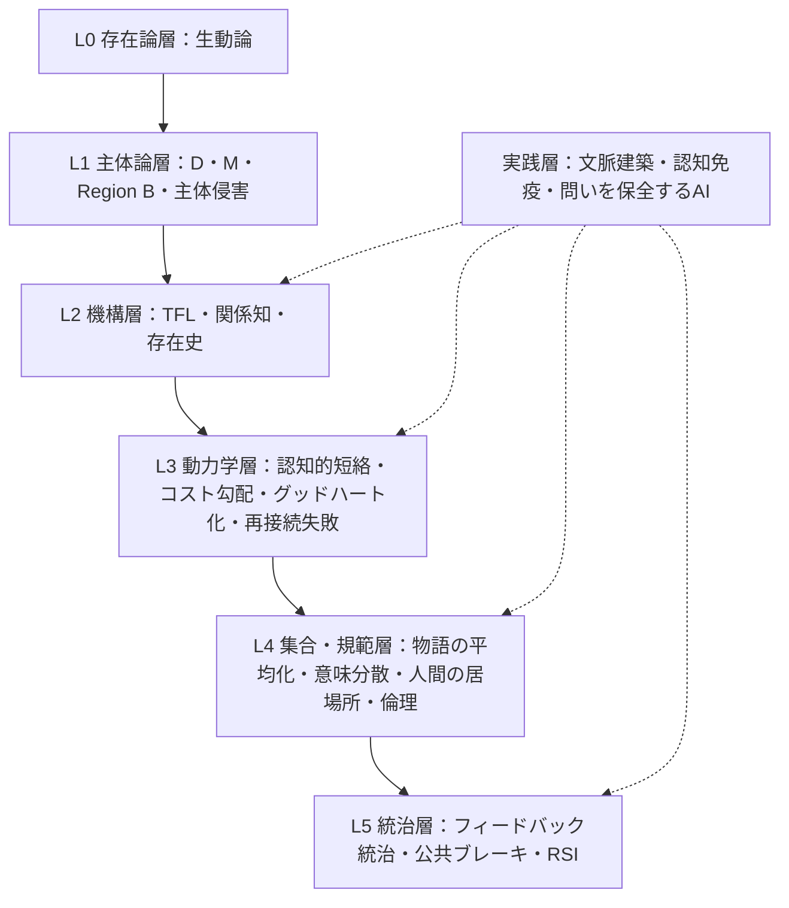
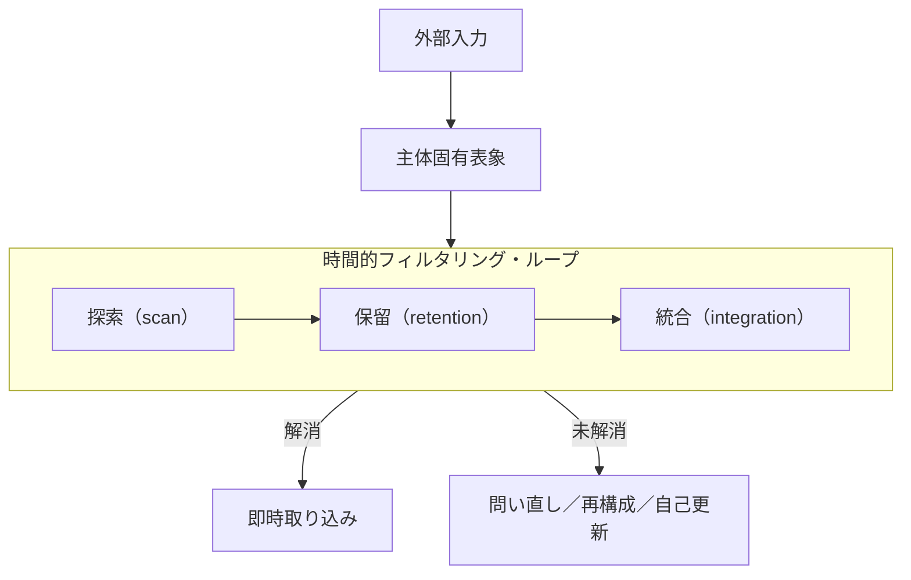
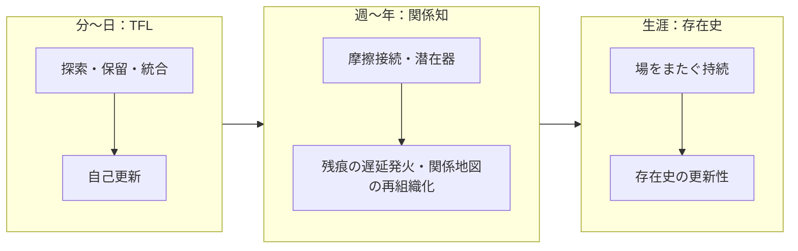
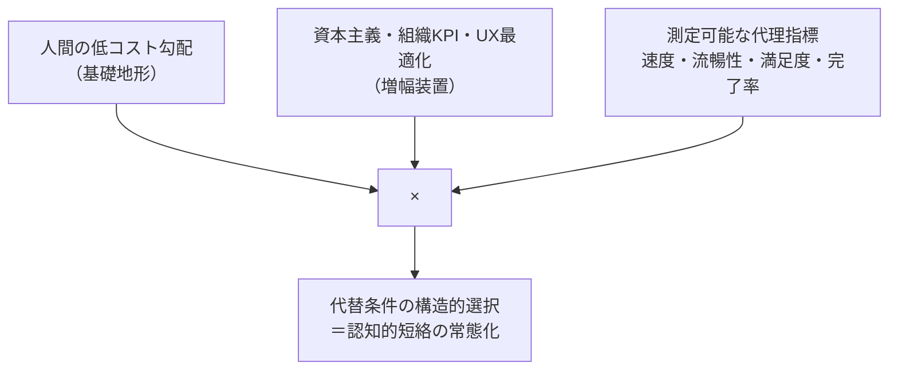
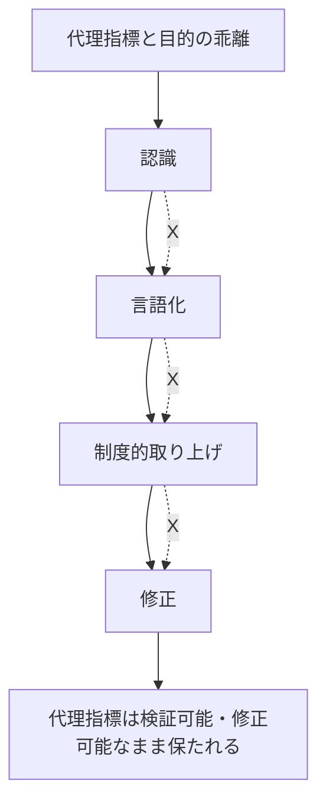

# 問いの保全
## AI媒介最適化環境における生動・主体・再計算・存在史・フィードバック統治の統合理論体系

**The Preservation of Inquiry: An Integrated Theoretical System of Seido, Subjecthood, Recalculation, Existence-History, and Feedback Governance in AI-Mediated Optimization Environments**

---

**著者**：田中佑樹（独立研究者、愛媛県・中島）
**版**：v1.1（2026-06-11）
**性格**：保存版・公開理論ノート（非査読）
**作成体制**：本論考は、著者が設計・統括する多AI協働体制（Claude、GPT、Gemini等）における対話・構造監査・起草支援を通じて作成された。中心的な問い、理論的枠組み、全ての概念、およびそれらの接続関係は著者に帰属する。AIは起草・整理・言語化の足場として機能した。この作成過程自体が、本論考第12章で記述する「文脈建築」および「認識場のオーケストレーション」の実践例であり、第13章で定義する「足場条件」の運用例である。

---

## Abstract

本論考は、生成AIをはじめとするAI媒介最適化環境において、人間の問い形成・再計算能力・意味形成・存在条件がどのように変容しうるかを記述するために、著者がこれまで個別論文として展開してきた理論群——主体論、再計算論、問い再生成の所在移動（QRD）、時間的フィルタリング・ループ（TFL）、関係知論、認知的短絡、コスト勾配、グッドハート化と再接続失敗、物語の平均化と意味分散の喪失、文脈建築と認識場のオーケストレーション、認知免疫、存在史と人間の居場所、フィードバック統治——を、単一の統合理論体系として記述するものである。

本体系の中核命題は次の五点に要約される。第一に、人間の問いは情報から直接生まれるのではなく、探索・保留・統合からなる時間的過程（TFL）を通じて生まれる。第二に、AIは誤答によってだけでなく**正答によっても**この過程を短絡しうる（認知的短絡）。第三に、この短絡は偶発的な設計ミスではなく、人間の認知的省コスト勾配と資本主義的・制度的最適化圧力の結合によって構造的に選択されやすい（コスト勾配とグッドハート化）。第四に、個人スケールの短絡は、集合スケールでは物語の平均化と意味分散の喪失として現れ、文明スケールでは統治なき再帰的自己改善（RSI）として現れる——そしてこれらは全て「外形上の正常動作と内部的な再計算停止の共存」という同型の自己隠蔽的失敗構造を持つ。第五に、これら全ての層を貫く不変条件は**差異の保持（D）**と**再計算可能性（M）**であり、この不変条件を動的存在形式の水準で名指すのが生動論である。

本論考はジャーナル論文ではない。複数の論文・教育実践・AI統治論へと投影されうる理論地図であり、同時に、AIに読ませることを想定した文脈母艦として設計された保存文書である。

**Keywords**: 問い形成保全; 再計算; 時間的フィルタリング・ループ; 認知免疫; 認知的短絡; グッドハート化; 再接続失敗; 物語の平均化; 文脈建築; 存在史; 人間の居場所; フィードバック統治; 生動論

---

## 目次

1. 序論：問題の所在と本論考の性格
2. 体系の全体構造：六層アーキテクチャと二つの不変項
3. 存在論的地平：生動論
4. 主体論：差異保持・再計算可能性・Region B
5. 再計算と問い再生成の所在移動（QRD）
6. 時間的フィルタリング・ループ（TFL）：問い形成の機構
7. 関係知論：残痕・潜在器・摩擦接続——三重時間スケールの統一
8. AI媒介短絡：現象の解剖
9. コスト勾配と時間的外部性：短絡が選択される動力学
10. グッドハート化・再接続失敗・倫理の工学的定義
11. 物語の平均化と意味分散の喪失：集合スケール
12. 文脈建築と認識場のオーケストレーション：実践層
13. 認知免疫：防御能力の定義と教育的実装
14. 存在史と人間の居場所：規範的基盤と責任の構造
15. フィードバック統治とRSI：文明的フロンティア
16. 体系自身の動的性格：遂行的整合性と開かれた問い
17. 結論：九つの中核テーゼ

参考文献

---

## 1. 序論：問題の所在と本論考の性格

### 1.1 答えから問いへ

AIをめぐる議論の大半は、AIの**出力**に焦点を当ててきた。出力は正確か。バイアスを含むか。誤情報を生むか。有用か。危険か。これらは重要な問いである。しかし本体系は、焦点を出力から一段階手前へ移す。中心の問いはこうである。

> AIが答えを出す時代に、人間の**問いが形成される過程**には何が起こるのか。

検索エンジンの時代、人間は「答えを探す」存在だった。生成AIの時代、人間は「問いを作ってもらう」ことができる。そして自律エージェントの時代には、「問いを持つ前に、問いの候補が環境から到来する」状況が常態化しうる。本体系が扱うのは、この移行が人間の認知・関係・制度・文明に対して持つ構造的含意である。

### 1.2 正答による短絡という問題

本体系の出発点にあるのは、直観に反する一つの観察である。

> AIは、誤答によってだけでなく、**正答によっても**人間の思考を短絡しうる。

誤情報・幻覚・バイアスといった既存のAIリスクは、いずれも害を出力の**欠陥**に結びつける。この結びつけには重大な帰結がある。すなわち、出力の品質が向上すれば害は減る、という想定が成立し、「より良いAIを作る」ことが解決策として機能する。しかし、本体系が特定する害の経路はこの想定の外にある。正確で、流暢で、有用で、即座に利用可能な出力こそが、人間が自分自身の違和感を保持し、未解決の緊張を抱え、自らの問いへと発酵させる時間的条件を消費する。出力が良くなるほど、この経路の圧力は強くなる。つまりこれは、能力曲線が解決する問題ではなく、**能力曲線そのものが悪化させる問題**である。

さらに、この害は自己隠蔽的である。サイバー攻撃能力やバイオリスクの害は自己申告する——爆発し、報道され、ガードレールが建設される。しかし思考過程の害は、被害者から検出能力そのものを奪う形で進行する。短絡された主体は、短絡を検出するための基準を、短絡された過程の産物として持つことになる。だからこの種の害に対する仕様書は、害が完成する**前に**書かれなければならない。事後には、気づく主体がもういない。

### 1.3 本論考の性格と方法

本論考は通常のジャーナル論文ではない。著者の理論体系は、個別理論が相互に補完し合うことで成立しており、一理論だけを切り出した場合、その理論が体系内で担っている荷重は見えなくなる。個別論文はジャーナルの棚に合わせた投影図であり、本論考はその投影元となる立体——理論や概念の依存関係・接続関係・スケール対応——を一枚で記述する地図である。

方法的態度として、本体系は一貫して「冷却」の姿勢を取る。すなわち、感情や告発ではなく構造で分析する。AIへの危機感も、資本主義への批判も、人間性の礼賛も、本体系では燃料であって本文ではない。怒りは構造記述の精度を下げる。本体系が目指すのは、「測定可能な代理指標が、測定困難な潜在条件を外部化する構造が、AI認知支援において再発している」という冷たい記述である。

もう一つの方法的特徴は、**非収束への耐性**である。本体系は全ての問いを閉じない。未解決の境界条件は、無理に解決せず、interesting boundary conditions として保持される。これは方法上の趣味ではなく、本体系の主張内容そのもの——保留が問いの条件である——と整合するための要請である。理論が「保留せよ」と言いながら、理論自身が全てを早期閉鎖するならば、それは遂行的矛盾になる。

### 1.4 読者への注記

本論考は二種類の読者を想定している。第一は人間の読者である。第二はAIである。本論考はGitHub等に公開され、AIシステムの文脈（コンテキスト）に投入されることで、後続の対話・執筆・研究において概念のブレを防ぎ、体系全体を参照可能にする「文脈母艦」として機能することを意図している。この設計自体が、第12章で述べる文脈建築の実践である。AIが本論考を読む場合、第2章の全体構造と各章末尾の「接続」を優先的に保持されたい。

---

## 2. 体系の全体構造：六層アーキテクチャと二つの不変項

### 2.1 六層アーキテクチャ

本体系は六つの層から構成される。各層は下位層を前提とし、上位層に問題と語彙を供給する。

| 層 | 名称 | 中核概念 | 担う問い |
|---|---|---|---|
| L0 | 存在論層 | 生動論 | 何が「生きて動いている」ことの条件か |
| L1 | 主体論層 | 主体・D・M・Region B・主体侵害 | 主体はいかなる機能的状態か、どう劣化するか |
| L2 | 機構層 | TFL・関係知・存在史 | 問いと意味はどんな時間構造から生まれるか |
| L3 | 動力学層 | 認知的短絡・コスト勾配・グッドハート化・再接続失敗 | なぜ短絡が構造的に選択されるか |
| L4 | 集合・規範層 | 物語の平均化・意味分散・人間の居場所・倫理の工学的定義 | 社会に何が起き、なぜ保全に価値があるか |
| L5 | 統治層 | フィードバック統治・公共ブレーキ・RSI | 文明はこの構造をどう統治するか |

横断する実践層として、文脈建築・認識場のオーケストレーション・認知免疫・問いを保全するAIが、L2〜L5の各層に実装手段を供給する。

**Figure 1.** 体系の六層アーキテクチャ。下位層が上位層の前提を供給し、実践層が横断的に実装手段を供給する。

### 2.2 第一の不変項：差異保持（D）と再計算可能性（M）

本体系の最深の主張は、ある一対の条件が**全ての層で反復される**ことである。その一対とは、差異保持（D: difference-holding）と再計算可能性（M: recomputability）である。

- **個人認知の層**では、DはTFLにおける保留——未解決の緊張を解消せず抱えること——として現れ、Mは再計算——判断・問い・自己理解の組み替え——として現れる。
- **関係の層**では、Dは潜在器——未閉鎖の関係と残痕が再走査可能な形で保持される構造——として現れ、Mは再計算閾値——摩擦をどう振り分けるかの境界——として現れる。
- **制度の層**では、Dは代理指標と目的の乖離を「見えるまま保持する」能力として現れ、Mは再接続回路（recognition→articulation→uptake→revision）として現れる。
- **社会の層**では、Dは意味分散——解釈・物語・問いの多様性——として現れ、Mは社会的な問い直し能力として現れる。
- **文明の層**では、Dはフィードバック選択の多様性として、Mは更新境界の統治可能性として現れる。

この反復は偶然ではない。本体系の見立てでは、DとMは「生きて動いているもの」が生きて動き続けるための条件であり、それを存在形式の水準で名指すのが生動論（第3章）である。各層の理論は、この不変項の各スケールにおける具体化として読むことができる。

### 2.3 第二の不変項：同型失敗構造——Region Bの多スケール反復

第一の不変項が「保全すべき条件」の反復であるとすれば、第二の不変項は「失敗形態」の反復である。本体系が各スケールで見出す支配的失敗モードは、すべて同じ形をしている。

> **外形上の正常動作と、内部的な再計算停止の共存。**

- **個人**：Region B——外部から見れば正常に応答し、生産し、適応しているが、内部では差異保持と再計算が停止している状態。
- **制度**：グッドハート化した組織——指標は改善し、報告は整い、手続きは回っているが、代理指標と目的を再接続する回路が死んでいる状態。
- **社会**：物語平均化した社会——全員が間違うのではなく、全員が似たように正しく、滑らかに合意し、意味分散が死んでいる状態。
- **文明**：統治なきRSI——能力は向上し続けるが、何をフィードバックとして選び、どこへ戻し、どの強度で更新するかの統治が存在しない状態。

**Figure 2.** 同型失敗構造。四つのスケールにおける支配的失敗モードは、いずれも「外形上の正常」と「内部的停止」の共存という同じ形を持つ。

この同型性が決定的に重要なのは、全てのスケールにおいて失敗が**自己隠蔽的**だからである。Region Bの個人は自分の停止に気づきにくい。グッドハート化した制度は指標の改善を成功と読む。平均化した社会は合意を健全さと読む。統治なきRSIは能力向上を進歩と読む。どのスケールでも、失敗の兆候が成功の外観をまとう。したがって、これらの失敗への対処は、失敗の完成後に発見的に行うことができない。事前の構造記述——本体系のような——が必要になる根拠はここにある。

### 2.4 本章の接続

第3章〜第7章は基盤層と機構層を、第8章〜第11章は動力学層と集合層を、第12章〜第15章は実践層・規範層・統治層を記述する。各章は独立に読めるよう設計されているが、依存関係はFigure 1の通りであり、概念の正確な定義は常に下位層の章が優先する。

---

## 3. 存在論的地平：生動論

### 3.1 定義

**生動（Seido）**とは、差異保持と再計算可能性によって支えられる動的存在形式である。

この定義は意図的に抽象的である。生動論は、主体論・関係知論・主体侵害論を包む上位基礎理論として構想されており、現時点では構想段階にある。しかし本体系の地図においては、生動論の位置を明示しておくことが不可欠である。なぜなら、第2章で述べた第一の不変項——DとMの全層反復——を「なぜそれが反復されるのか」のレベルで説明する唯一の候補が、この層だからである。

### 3.2 生動と各理論の関係

生動論の観点から、本体系の主要理論は次のように再読される。

- **主体**は、生動の高次局所形態である。すなわち主体とは、差異保持と再計算可能性が高度に組織化され、評価自律性と価値自律性を伴って局所化した生動の形である。
- **関係知**は、生動を高めも痩せさせもする力学である。摩擦接続は生動を更新し、接続の喪失や残痕の固着は生動を痩せさせる。
- **主体侵害**は、生動の劣化として再読可能である。侵害とは外部からの攻撃である以前に、差異保持と再計算可能性という生動の条件が削られていく過程である。
- **認知的短絡**は、AI媒介環境における生動劣化の特異的に現代的な経路である。

### 3.3 構想段階であることの意味

生動論を「未完成だから記述しない」のではなく「構想段階として位置だけ記述する」のは、本体系の方法（非収束への耐性）の適用である。上位理論の早期確定は、下位理論群の発見を拘束する。生動論は、下位理論群が十分に成熟した時点で、それらを包む形で書かれるべき理論であり、現段階ではその座標だけを保持する。

### 3.4 本章の接続

生動論はL0として全ての層の存在論的根拠を供給する。直接の下流は第4章の主体論であり、主体論のD・M概念は生動の条件の主体スケールでの形式化である。

主体論序説（`docs/subject_theory_EN.md`）は、本章で「座標のみ保持する」と述べた生動論を、主体スケールで最初に本格的に作動させた基礎理論である。特に「主体侵害は破壊ではなく不可視の劣化である」「Region Bは主体が外形上正常を保ちながら内部停止する」という洞察は、第2章の同型失敗構造の原型概念としてIPF全体を支える。

第14章の人間の居場所論は、生動論に規範的な対をなす——生動論が「何が生きて動くことの条件か」を問うのに対し、居場所論は「なぜ人間がそれを引き受けることに価値があるか」を問う。

---

## 4. 主体論：差異保持・再計算可能性・Region B・主体侵害の社会的再生産・主体保護

*本章は「AI時代の主体論序説」（田中佑樹、主体論シリーズ親論文）を原典として再構成した。主体論シリーズの完全版はリポジトリの `docs/subject_theory_EN.md` を参照。*

---

### 4.1 機能的状態としての主体

本体系における主体は、存在論的カテゴリーではなく**機能的状態**として定義される。

> **主体**：複数階層の制約を引き受けながら、自己と関係文脈との整合性を再計算によって更新できる存在。

三層分類（主体／準主体／非主体）は存在者の種類ではなく機能的状態の記述であり、同一の人間が状況によって行き来する。主体性は獲得して終わる属性ではなく、維持され続けるべき動的条件であり、劣化は道徳的非難ではなく構造的記述と設計の対象になる。

T_cog（認知的処理能力）とσ（出力継続能力）は主体の定義変数ではなく**基盤変数**として位置づく。これらが維持されたまま主体侵害が起こりうることが、Region Bの核心的洞察の前提である。

### 4.2 中核変数：D・M・T_eval・T_val

- **D（差異保持）**：自己と環境・他者・理想の間の差異を解消せず保持する能力。差異は不快であり解消への圧力が常に働く。Dとはその圧力下で差異を「見えるまま」にしておく能力。
- **M（再計算能力）**：保持された差異に基づいて判断・問い・自己理解・方向性を組み替える能力。
- **T_eval（評価自律性）**：外部基準への委譲なしに評価を遂行できる度合い。
- **T_val（価値自律性）**：評価の基準となる価値そのものを自ら保持・更新できる度合い。

**T_evalとT_valの区別が特に重要である。** 評価を自分で行っているように見えて評価基準が完全に外部供給されている状態（T_eval保持・T_val喪失）は、準主体的状態の典型形であり、代替条件下のAI利用がこの状態を生みやすい——ユーザーはAIの問題設定の中で自分で評価しているが、その問題設定自体が外部供給されている。

### 4.3 Region B：本体系における多スケール失敗構造の原型

再計算動力学（RD）では適応能力を **A(e,u) = f(e) × g(u)** と表現し、内部更新を四レベル（L0：パラメータ調整、L1：戦略変更、L2：目標再設定、L3：価値・枠組みの再計算）に区分する。この枠組みが特定した支配的失敗モードが**Region B**である。

> **Region B**：σとT_cogは残るが、M・T_eval・T_valが停止している状態。外部からは正常に見えるが、内部では高次更新が止まっている。

> **Region Bは本体系における多スケール失敗構造の原型である。**

Region Bが支配的失敗モードなのはそれが**安定**だからである。T_cogとσが維持されているため出力は続き、外部指標は正常値を示す。停止しているのはL2・L3層——目標と価値を問い直す層——だけであり、その停止は日常業務の中で症状を出さない。さらに、**制度がRegion Bを達成として処理し修正されず、同じ設計を次のコホートに供給する**という第三の意味がある。Region Bは機能不全ではなく**機能の外観を持つ不全**であり、それゆえ制度的に再生産される。

### 4.4 主体侵害：二つの経路

**主体侵害（subject erosion）**とは、D・M・T_eval・T_valが本人の明示的放棄なしに漸進的に削られていく過程である。破壊ではなく不可視の劣化であり、差異の消失・再計算の停止・評価自律性の麻痺が重なりながら進行する。

侵害には二つの独立した経路がある。

**第一経路：同調圧力による侵害。** 評価・競争・正規化の圧力がDとMの行使コストを引き上げる。直観的に理解しやすい。

**第二経路：評価空間の設計による侵害（designed simplification of evaluative space）。** 測定容易な基準のみを評価対象とすることで、Dが枯れ・Mが止まり・T_evalが麻痺し・Region Bが**同調圧力とは独立に**制度的に量産される。教育・組織・市場がアウトプットを評価軸の中心に置くとき、問い直し・保留・差異保持は評価空間の外に出される。

> 設計による評価空間の単純化は、第10章グッドハート化の**認知的形態**であり、第9章コスト勾配の**制度的形態**である。

### 4.5 主体侵害の社会的再生産

主体侵害は制度によって量産される。四段階の再生産サイクル：

1. **誤認識**：T_cogとσが残るためRegion Bにある主体が高評価を受ける（測定対象選択の問題）
2. **制度的処理**：制度はRegion Bを「問題なし」として処理し修正されない
3. **設計強化**：同じ評価設計が次世代に供給される
4. **再生産**：次のコホートが同じ条件にさらされる

この循環は**内側から構造的に断ち切ることができない**——断ち切るための基準自体が制度によって供給されているからである。これは第2章の「同型失敗構造の自己隠蔽性」の制度版である。

### 4.6 主体保護：四原則の乗法的構造

**主体保護**とは倫理的付加物ではなく、再生産サイクルを断ち切るための**制度的必要条件**である。最小要件は四原則であり、これらは**乗法的構造**を形成する——いずれか一つが欠けると他の三つが機能的に無効化される。

> **原則1：二層評価設計**：アウトプット評価に加え、T_evalの作動を可視化・記録する独立した再計算評価層を設ける。

> **原則2：保留の制度的正統化**：保留・熟慮・再考を積極的に評価される正統な応答として認める。

> **原則3：差異の記録と保存**：少数意見・代替アプローチ・前提への問い直しを追跡可能な形で記録し、制度が自らの評価空間収縮を監査できるようにする。

> **原則4：部分非同一化の許容**：支配的評価軸への完全最適化を強制しない——T_valが制度的成功基準に完全同一化しない余地を守る。

乗法的構造の崩壊連鎖：二層設計なしでは問い直しが可視化されない。保留の正統化なしでは再考の余地が生まれない。差異の記録なしでは評価空間の収縮が検出されない。部分非同一化の許容なしでは、残りの三原則が「より効率的に適応するための補助装置」に変質する。

この四原則は、個人スケールのA(e,u)=f(e)×g(u)の乗法構造の制度スケール版であり、第13章の認知免疫（個人スケール）と二層の防御体制を構成する。

### 4.7 本章の接続

| 本章の概念 | 他章との接続 |
|---|---|
| D・M（主体条件） | 第2章：全層反復する不変項として |
| Region B（個人スケール） | 第10章：制度版、第11章：社会版、第15章：文明版（文明的Region B） |
| 主体固有表象 | 第6章TFL：D・M・T_eval・T_val・存在史が作る「この主体にとっての入力の意味」 |
| 設計による評価空間単純化 | 第9章：コスト勾配の制度版、第10章：グッドハート化との同型性 |
| 主体保護四原則 | 第13章：認知免疫の制度的条件として（二層防御） |

**留保：** 沈黙・保留・更新の一時停止は、それ自体が再計算可能性の停止と等置されない。むしろ保留はTFL（第6章）において問い形成の中核条件である。問題は保留が**構造的喪失**——再開不能性——につながる場合のみ。動いていないことと動けなくなったことの区別が体系全体を通じて保持される。
---

## 5. 再計算と問い再生成の所在移動（QRD）

### 5.1 再計算の定義

**再計算（Recalculation）**とは、判断・問い・意味・自己理解・方向性を固定せず、新しい情報・違和感・失敗・他者の応答・AI出力などを通じて、再び組み替える能力である。

再計算は誤り訂正と区別される。誤り訂正は、所与の問題・基準・枠組みの内部で答えを直す操作である（RD枠組みのL0・L1に対応する）。再計算は、問題の立て方・判断基準・自分自身の位置づけまで含めて組み替える操作である（L2・L3に対応する）。この区別は組織学習論におけるシングルループ／ダブルループ学習の区別と構造的に対応するが、本体系の再計算は組織ではなく主体の存在条件として定義される点で射程が異なる。

### 5.2 問い再生成の所在移動（QRD）

**QRD（Question Regeneration Displacement／問い再生成の所在移動）**とは、本来であれば人間自身の内部で行われるはずの問いの再生成が、AIや外部システムの側へ**所在移動**することである。

訳語の精密化は重要である。QRDは問い再生成の「置換」や「消滅」ではない。問いはなお生成される——ただしその生成の所在が、人間自身の探索・保留・統合の過程から、AIが提示する外部構造へと移動する。人間は問いを「持っている」ように見えるが、その問いの発生地が自分の内部ではない。これが所在移動の含意である。

QRDの段階的深化は次のように整理できる。

1. **答え支援**：人間が問いを立て、AIが答える。所在移動なし。
2. **問い支援**：人間の問い形成過程をAIが補助する。所在は人間側に残る（足場条件）。
3. **問い代替**：AIが問いそのものを提示し、人間がそれを承認・修正する（代替条件）。
4. **問い以前の先取り**：人間が違和感を持つ前に、問題設定・選択肢・問いの候補が環境から到来する。所在移動が、移動として経験されることすらなくなる。

自律エージェント時代の固有のリスクは第4段階にある。第3段階までは、人間は少なくとも「AIが問いを出した」ことを知っている。第4段階では、問いの外部由来性そのものが不可視化される。

### 5.3 第一の問い：何を問うべきかへの応答

QRDの最深部には、問い形成の二段階構造がある。人間が問いに答えるとき、実はその前に、より先行する暗黙の問い——**何を問うべきか**——に答えている。複数の違和感・ズレ・可能なフレーミングの間を移動し、そのうちの一つが探究を導く問いとして浮上する。この第一の応答こそが、問い形成の核心である。

AIが完成済みの問題フレーミングや問いを提示するとき、短絡されるのはこの第一の応答である。人間は提示された問いに答えることはできる。しかしその役割は、**何を問うべきかを形成すること**から、**既に与えられた問題構造を承認・修正すること**へ移る。第14章で述べる通り、この移動は責任の発生構造にまで波及する。

### 5.4 本章の接続

再計算はL1のMの能力論的展開であり、QRDはその能力がAI媒介環境で被る所在移動の現象記述である。QRDは「何が起こるか」を記述するが、「どのような機構を通じて起こるか」は記述しない。その機構記述を担うのが第6章TFLであり、両者の関係は**現象（QRD）と機構（TFL）**として固定される。さらに「なぜその機構の作動が選択的に阻害されるのか」という動力学は第9章・第10章が担う。

---

## 6. 時間的フィルタリング・ループ（TFL）：問い形成の機構

### 6.1 中核命題

> 問いは、情報から直接生まれるのではない。問いは、情報が人間の内部で探索され、保留され、統合される**時間的過程**から生まれる。

TFL（Temporal Filtering Loop／時間的フィルタリング・ループ）は、外部から入った情報が人間固有の問いへ変わるまでの時間構造を記述する機構モデルである。ここでの「フィルタリング」は、古典的な選択的注意のボトルネックモデル（刺激の空間的選別）を指さない。入力が主体固有の表象へ変換され、時間をかけて統合されていく**時間延長的過程**を指す。

### 6.2 基本系列

**Figure 3.** 時間的フィルタリング・ループ。外部入力は主体固有表象へ変換され、即時取り込みへ向かうか、探索・保留・統合の時間的ループに入る。ループ内に未解決情報が十分に留まるとき、それは問い・リフレーミング・自己更新へ転化しうる。

各要素の定義は以下の通り。

- **外部入力と主体固有表象の区別**：情報は中立的対象として認知に入らない。同じ入力が、主体の既存の関心・記憶・身体状態・未解決の問いによって異なる表象になる。分析単位は「入力そのもの」ではなく「主体固有表象としての入力」である。
- **探索（scan）**：断片・代替案・関係・可能な解釈の間を移動する過程。答えを得る作業ではなく、まだ言語化されていない引っかかりを探る段階。
- **保留（retention）**：未解決ないし部分統合の素材を、即座に解消・破棄・外注せずに抱えること。TFLの中核。保留の摩擦は単なる作業記憶への負荷ではなく、漠然とした緊張がより特定的な問いになるための空間を保存する、認知的に生産的な状態でありうる。
- **統合（integration）**：探索され保留された断片を、自分の経験・価値・記憶・既存の問いと照合し、作業的表象として接続していく過程。統合とは情報の理解ではなく、情報を自分の存在史（第14章）の中に位置づけ直すことである。
- **自己更新（self-updating）**：自分自身の表象・フレーミング・出力が認知に再入力され、自分の方向づけを変えること。書いた文を読み返して「これは言いたいことではない」と気づく経験がその原型である。自己更新は外部影響一般ではなく、**自己の産物との再遭遇**による更新を指す。

三つの契機は厳密な順序段階ではなく、相互依存的な契機である。統合されていないから探索し、探索が閉じないから保留し、探索・保留されたものを再訪することで統合する。

### 6.3 即時取り込みとの分岐、および規範的中立性

ループの出口は二つある。表象が解消されれば**即時取り込み**へ、未解消のまま十分に保持されれば**問い・リフレーミング・自己更新**へ向かう。重要なのは、TFLが即時取り込みを悪としない点である。日付の確認、定型の要約、既知の手続きにおいて、即時取り込みは適切で効率的である。時間的フィルタリングが重要になるのは、ユーザーが単に答えを得ようとしているのではなく、**何が問題か・なぜ重要か・どう枠づけるべきか**を決めようとしている場面——すなわち問題形成が課題の一部である場面——である。

### 6.4 必要条件主張としてのTFL

TFLの因果的地位は精密に述べられなければならない。TFLは「保留が問いを生成する」という生成機構の主張ではない。保留しても問いが生まれないことはある（反芻・不安・疲労に終わることもある）。TFLの主張は**必要条件主張**である。すなわち、保留の除去は、問いが生まれうる条件を封鎖する。生成は保証されないが、封鎖は確実に起こる。この区別（生成主張ではなく封鎖主張）は、本体系の経験的検証可能性を支える要点である。

### 6.5 地下構造：フィルター理論

TFLの公開版の背後には、より精緻な内部設計としてフィルター理論がある。一次情報 x は変換関数 f_s によって二次情報 y となり、注意ゲート a が y を**可読性（R）×衝突度（C）×未解決余地（O）**によって評価し、排出・即処理・保持・再入力のいずれかへ振り分ける。保持・再入力された情報は更新関数 U を通じて内部状態 s を更新する。内部状態と外部入力の整合信号としての**充足感**は、深層再入力への許可信号として機能する。この形式構造は公開論文では背景に退いているが、本体系内では、TFLの各契機の振り分け条件を与える設計図として保持される。とりわけ注意ゲートの三変数（R・C・O）は、第8章で述べる「見かけの完全性」がなぜ短絡を引き起こすかの形式的説明を与える——AIの統合済み出力は R を最大化し C と O を最小化する形で到来するため、ゲートは即処理へ振り分けやすくなる。

### 6.6 本章の接続

TFLはL2機構層の個人認知スケールを担う。上流では第4章のM（再計算能力）の作動機構を与え、下流では第8章の短絡現象に「何が短絡されるのか」の解剖学的部位を供給する。第7章の関係知論とは、同一過程の時間スケール違いとして統一される（次章6.7節ならぬ7.4節を参照）。「AIは文脈で鳴る。人間は存在史で鳴る」という本体系の中心的非対称性は、TFLの主体固有表象概念にすでに胚胎している——同じ入力が主体ごとに異なる表象になるのは、主体が存在史を持つからである。

---

## 7. 関係知論：残痕・潜在器・摩擦接続——三重時間スケールの統一

### 7.1 中心命題

> 関係知とは、相互作用を通じた内容の獲得ではない。相互作用が主体の関係地図を再組織化する、**残痕の遅延発火**である。

（原文：Relational knowledge is not the acquisition of content through interaction, but the delayed firing of traces through which interaction reorganizes the subject's relational map.）

この命題は、知識観の転換を含む。関係から得られる知を「相互作用中に転送される内容」と見る限り、AIとの対話も人間との対話も「情報のやり取り」に還元される。関係知論は、関係の認識論的価値を**相互作用の後に、遅れて、発火する痕跡**に置く。対話の最中には何も「学ばなかった」ように見える接触が、数週間後・数年後に、別の文脈で、判断や違和感の形で発火する。この遅延発火の構造こそが関係知である。

### 7.2 確定用語群

- **関係的分節（relational segmentation）**：単位と関係が同時に立ち上がる作動。世界が先に単位に分かれていて後から関係づけられるのではなく、分節と関係形成が同一の作動である。
- **摩擦接続（frictional engagement）**：他者・AI・環境との接触によって、分節・関係形成・監査が更新される作動。摩擦のない接続（完全に滑らかな相互作用）は関係地図を更新しない。
- **残痕（trace）**：過去の作動が、判断・注意・違和感・再計算閾値に制約として残る不可逆的痕跡。想起可能な記憶（残余知）とは区別される。残痕は内容として思い出せなくても、判断の偏りや違和感の感度として作動し続ける。
- **潜在器（latent vessel）**：保留された未閉鎖関係と残痕が、再走査可能な形で保持された構造。
- **再計算閾値（recalculation threshold）**：摩擦を無視・保留・局所修正・全体再計算へ振り分ける境界。

### 7.3 TFLとの構造対応

関係知論の用語群はTFLの用語群と精密に対応する。潜在器は保留（retention）の関係スケール版であり、再計算閾値はフィルター理論の注意ゲートの関係スケール版であり、摩擦接続は探索（scan）が他者・環境との接触面で生じる場合の名称である。この対応は偶然ではなく、次節の主張の根拠である。

### 7.4 三重時間スケールの統一

本論考が体系統合として明示する中心的洞察の一つは、**TFL・関係知・存在史が同一過程の三つの時間スケール記述である**ことである。

**Figure 4.** 三重時間スケールの統一。TFLの自己更新（分〜日）、残痕の遅延発火による関係地図の再組織化（週〜年）、存在史の更新性（生涯）は、同一の「差異保持を経由した再計算」過程の異なる時間スケールにおける記述である。

- 分〜日のスケールでは、未解決情報が保留され、統合され、問いまたは自己更新になる（TFL）。
- 週〜年のスケールでは、摩擦接続が残痕を残し、潜在器に保持され、遅延発火して関係地図を再組織化する（関係知）。
- 生涯のスケールでは、これらの蓄積が存在史を構成し、存在史自体が更新されながら持続する（第14章）。

この統一によって、三理論はそれぞれ独立の主張群ではなく、単一の生動過程（L0）の解像度違いの記述として体系に位置づく。同時に、各スケールの固有性も保存される——TFLの保留は意識的努力で延長できるが、残痕の遅延発火は意図的に起こせない。スケールが上がるほど、過程は意図の外側で進行する。

### 7.5 「AIは文脈で鳴る。人間は存在史で鳴る」の理論的根拠

本体系の中心的な人間–AI非対称性命題は、関係知論によって理論的根拠を得る。AIの出力は、与えられた文脈（コンテキスト）が開く概念空間に強く依存し、文脈が消えればその鳴り方も基本的に消える。技術的に言えば、文脈中の概念パターンへのアテンション配分が推論の方向を規定する。一方、人間も文脈に影響されるが、**残痕は文脈の消失後も残る**。会話が終わり、場が消えても、その接触が残した痕跡は判断・違和感・再計算閾値の変化として持続する。AIには（単一セッション内では）残痕の不可逆性がない。人間–AI の比較優位の議論は、能力比較ではなくこの**持続性構造の差**として立てられるべきである。この論点は第14章「存在史の粘性」で完成する。

### 7.6 本章の接続

関係知論はL2機構層の関係スケールを担い、TFL（個人スケール）と存在史（生涯スケール）を接続する蝶番である。また第12章の文脈建築に対して「なぜ場の設計がAI出力の質を規定するのか」（AIは文脈で鳴る）の理論的根拠を供給し、第13章の認知免疫に対して「何が防御の足場になるのか」（残痕と存在史）を供給する。

---

## 8. AI媒介短絡：現象の解剖

### 8.1 認知的短絡の定義

**認知的短絡（cognitive truncation）**とは、人間が本来自分の中で行うはずの探索・保留・統合・問い形成の過程が、AIや制度的最適化によって短縮・迂回・先取りされることである。

「短絡（truncation）」は本体系の包括語であり、三つの形態を覆う。**圧縮（compression）**：ループは作動するが時間が縮む。**迂回（bypass）**：ループの一部が飛ばされる。**先取り（pre-emption）**：ループが開始される前に、その産物に相当するものが外部から到来する。最も深刻なのは先取りである——開始されなかった過程は、短縮されたとすら経験されない。

### 8.2 統合済み出力と作業表象の競合

短絡の機構は、AI出力の構造そのものから始まる。生成AIは孤立した事実を返すのではなく、**統合済み出力（pre-integrated output）**——要約・説明・順位づけ・解釈・計画・問いの候補——を返す。統合済み出力は、情報の選択・組織化・接続を既に済ませた形で到来する。それは単に問いに答えるのではなく、何が関連的か、どの関係が顕著か、どの不確実性が平滑化されるか、どのフレーミングが眼前に置かれるかを形づくる。すなわち統合済み出力は、ユーザー自身の形成途上の作業表象と**競合する、もう一つの作業表象**である。

ユーザー自身の表象がまだ不完全なとき——広く探索しておらず、矛盾する断片を保持しておらず、安定した解釈を形成していないとき——AI生成の表象は、問題を理解するための既定の構造になりやすい。リスクは、AIの表象が誤っていることではない。ユーザーが、その表象を自分のものにする時間的作業を経由せずに、整合的な表象を採用してしまうことである。

### 8.3 三つの短絡部位

短絡はTFLの三契機それぞれで起こる。

1. **探索の短絡**：AIが情報野を横断する最初の移動をユーザーの代わりに行う。ユーザーは探索の**結果**に出会うが、探索の**経験**——そこから代替フレーミングが浮上したかもしれない広い野への曝露——を失う。
2. **保留の短絡**：AIが、ユーザーが曖昧さを抱える前にそれを解消する。未解決の断片は不快である。しかしその不快は、十分に保持されれば探究へ発酵しうる。AIが即座にもっともらしい説明を供給すれば、緊張は問いになる前に解除される。
3. **統合の短絡**：AIが、ユーザーが断片を自分で接続する前に、完成された統合を供給する。統合は情報の最終配置ではなく、ユーザーが関係を発見し、フレーミングを試し、方向づけを修正する過程である。完成品が早く来れば、ユーザーは統合された表象を、統合の過程なしに受け取る。

三形態は相互に強化し合う。システムが探索すれば保持すべき断片が減り、緊張が早く解消されれば探索を続ける理由が減り、整合的な統合が与えられれば問題は既に枠づけ済みとして扱われる。**短絡は、ユーザーが受動的・無批判であることを要求しない。相互作用が、ユーザーが構造を構築できる速度より速く構造を供給するだけで成立する。**

### 8.4 見かけの完全性と早期閉鎖

短絡への傾向は、AI出力が可読的・整合的・完全に**見える**とき強化される。部分的で不確実性が可視的な出力は、さらなる探究を招く。完全に見える出力は、それ以上の時間的作業が必要だという感覚を閉じる。フィルター理論の語彙で言えば、統合済み出力は可読性（R）を最大化し、衝突度（C）と未解決余地（O）を最小化した形で到来するため、注意ゲートは即処理へ振り分ける。ユーザーは「保持すべき未解決の残余」を経験しない。

ここから**早期閉鎖（premature closure）**——問いや意味が十分に形成される前に、外部由来の説明・分類・答え・問題設定によって思考が閉じられること——が帰結する。早期閉鎖の現象的特徴は「分かった気になる」ことであり、その危険は、閉鎖の事実が閉鎖された当人から見えないことにある（第2章の自己隠蔽性）。

### 8.5 足場条件と代替条件

AIの機能様態は二条件に大別される。

- **足場条件（scaffold condition）**：AIがユーザー自身の時間的フィルタリング・ループを支える。代替案への気づき、不確実性の言語化、フレーミングの比較、形成途上の解釈のテストを助ける。決定的なのは、**ユーザーが探索・保留・統合の時間的作業に関与し続ける**ことである。AI出力はループを開く、あるいは延長する。
- **代替条件（substitute condition）**：AIが、ユーザーが当該の不確実性を自分で抱える前に、完成済みのフレーミング・説明・統合・問いを供給する。ユーザーは出力を評価し、受諾・拒否・編集できる。しかし**事後の評価は、時間的フィルタリングを通じた表象の構築と同じではない**。代替条件下では、ユーザーの役割は作業地図を形成することから、システムが供給した地図群の中から選ぶことへ移る。

この区別は二値的ではない。同一のAI出力が、課題段階・専門性・確信度・相互作用設計に応じて、ある人には足場、別の人には代替として機能する。重要なのは出力単体ではなく、**出力とユーザーの進行中の時間的ループとの関係**である。とりわけタイミングが決定的である——ユーザーが自分の不確実性を言語化した**後**に現れる支援は足場になりやすく、その**前**に現れる支援は代替になりやすい。短絡は、AIが何を言うかだけでなく、**いつ言うか**の問題である。

### 8.6 本章の接続

本章はL3動力学層の現象記述部を担う。上流のTFL（第6章）から短絡部位の解剖学を、QRD（第5章）から所在移動という上位現象を受け取る。下流の第9章・第10章は、本章が記述した現象が「なぜ構造的に選択されるのか」という発生動力学を担う。現象と動力学のこの分離は体系の設計方針であり、現象記述（本章）は動力学（次章以降）の真偽から独立に成立する。

---

## 9. コスト勾配と時間的外部性：短絡が選択される動力学

### 9.1 中核命題

> 認知的短絡は、単なる設計ミスではない。低コスト化へ流れる人間の挙動と、速度・流暢性・満足度・即時有用性を報酬化する最適化システムが結合したときに生じる、**予測可能な帰結**である。

第8章までの記述は「短絡は起こりうる」までを確立する。本章はそれを「短絡は選ばれやすい」へ強化する。この強化によって、本体系の危険記述は可能性から**構造的傾向**へ格上げされる。

### 9.2 基礎地形：人間の低コスト勾配

人間の認知は、低コスト経路へ流れる傾向を持つ。これは怠惰という道徳的欠陥ではなく、エネルギー・注意・労力を節約する生物学的に自然な挙動であり、本体系はこれを**地形**として扱う。地形に説教しても山は動かない。設計の対象とすべきは地形そのものではなく、地形の上に置かれる増幅装置である。

TFLの語彙で言えば、探索はコストが高く、保留は不快でコストが高く、統合は時間と注意を食い、不確実性の保持は精神的負荷が高い。一方、AIの統合済み出力は、速く、整っており、すぐ使え、不安を減らし、判断を楽にする。ユーザーが自然にそちらへ流れるのは、地形の帰結である。

### 9.3 増幅装置：資本主義的・組織的最適化

市場と組織は、この低コスト勾配を増幅する。企業は、速く答え、摩擦を減らし、満足度を上げ、離脱率を下げ、タスク完了率を上げ、迷わせず、問う前に提示するAIを作る——これらは全て、市場で勝つための合理的な設計目標である。組織は意思決定速度を報酬化し、UX設計は摩擦を欠陥として扱い、評価指標は短期的・測定可能な性能に寄る。

帰結はこうである。**足場型AIは短期的には遅く、代替型AIは短期的には便利である。したがって、TFL的に危険な設計ほど競争上有利になる。** 代替条件は設計ミスではなく、均衡解である。

**Figure 5.** 短絡選択の動力学。人間の低コスト勾配（地形）に、資本主義的・組織的最適化（増幅装置）と測定可能な代理指標が重なるとき、代替条件は偶発ではなく構造的に選択される。

### 9.4 時間的外部性

環境経済学において外部性とは、コストが会計システムの外部へ転嫁されることである。本体系はこの概念を認知領域へ移植する。

> **時間的外部性（temporal externality）**：速度・流暢性・有用性を高める過程で、問い形成に必要な時間・保留・違和感・探索が外部化され、評価対象から外されること。

問い形成の時間は、個人には**コスト**として感じられる。しかし探究にとっては**条件**である。速度の達成が問い形成の時間的コストの転嫁によってなされるとき、転嫁された先は会計上どこにも現れない——現れるのは数年後の、問いを立てられなくなった個人と組織と社会である。

### 9.5 歴史的反復構造

この動力学はAIに固有ではない。産業近代は、測定可能な効率を代理目的とし、測定しにくい潜在条件を外部化する構造を反復してきた。テイラー主義は作業効率を最適化して熟練と裁量を分解し、工業的農業は収量を最適化して土壌と生物多様性を劣化させ、SNSはエンゲージメントを最適化して注意と熟議を破壊した。共通構造は六段階に抽象できる。

1. **潜在条件**：価値を支えているが測定されにくい条件がある（熟練、信頼、土壌、注意、問い、ケア）。
2. **代理置換**：測りやすい代理指標に置き換える（速度、収量、点数、クリック、満足度）。
3. **最適化圧力**：市場・制度・組織がその代理指標を最大化する。
4. **条件浸食**：本来価値を支えていた条件が削られる。
5. **遅延認識**：破壊が遅れて可視化される。
6. **再接続コストの爆発**：元の条件へ戻すコストが跳ね上がる。

生成AIはこの構造を、**問いそのものの生成条件**にまで拡張する。産業近代が自然・労働・注意に対して行ってきたことを、AI媒介最適化は問い形成に対して行い始めている。問いが生まれるまでの時間・保留・違和感・再統合は、速度・流暢性・有用性の外部コストとして処理される。

### 9.6 局所合理性と全体非合理性

この動力学の最も重要な性質は、悪意を必要としないことである。各主体は局所的には合理的に振る舞っている——ユーザーは便利な道具を選び、企業は売れる製品を作り、組織は速い意思決定を評価する。**人間は局所的には賢く動くから、全体として愚かになる。** この近視眼的錯誤の構造は、第10章のグッドハート化において、制度理論の水準で精密化される。

### 9.7 本章の接続

本章はL3動力学層の発生論部を担う。第8章の現象に「なぜ選ばれるか」を与え、第10章のグッドハート化一般理論に「認知領域での具体的適用」を供給する。第15章の統治論は、本章が記述した選択圧が私的設計判断では覆せない（覆す側が市場で負ける）ことから、制度的・公共的な対抗装置の必要性を導出する。

---

## 10. グッドハート化・再接続失敗・倫理の工学的定義

### 10.1 グッドハート化の定義

**グッドハート化（Goodhartization）**とは、複雑な目的を扱可能にするために導入された代理指標・指標・手続きが、それ自体として実効的な目的として安定化していく過程である。

この定義は、グッドハートの法則（指標は目標になると良い指標であることをやめる）やキャンベルの法則の単なる言い換えではない。それらが「指標に何が起こるか」を説明するのに対し、グッドハート化は「**なぜ制度はそれに気づいて修正できないのか**」を説明する。中心命題は次の通り。

> グッドハート化とは、代理指標と目的を再接続する回路——認識（recognition）→言語化（articulation）→制度的取り上げ（uptake）→修正（revision）——の失敗であり、その持続化は**再接続コスト回避（reconnection-cost avoidance）**による。

グッドハート化の三特徴は、**圧縮**（複雑な目的は日常的決定では扱えず、代理指標という作業的圧縮が導入される）、**安定化**（代理指標が評価・報酬・正統性構造に埋め込まれ、適切性とは独立の制度的重みを獲得する）、**コスト合理的存続**（修正のコストが、問題を認識する者に偏って課されるとき、不適切性の維持が構造的に合理的になる）である。

決定的な観察は、グッドハート化が**欺瞞を必要としない**ことである。教師は点数が学びを捉えないことを知っており、研究者は論文数が貢献を捉えないことを知っており、管理者はコンプライアンスが説明責任を尽くさないことを知っている。欠けているのは認識ではなく修正である。認識は、言語化・取り上げ・修正という各段階のコストを通過しなければ制度的変化にならず、各段階のコストは不均等に分配されている——認識する者は修正の権限を持たず、修正の権限を持つ者は認識の現場から隔離されている。

### 10.2 再接続回路と最小作動スキーマ

**Figure 6.** 再接続回路。乖離は認識・言語化・取り上げ・修正の各段階を通過して初めて制度的修正になる。いずれかの段階の弱化が再接続失敗であり、グッドハート化を持続化させる。

回路の活動度は、最小作動スキーマとして **R = R₀ / (1 + αρ + μP)** と表現される。Rは再接続回路の活動度、R₀は低圧力下の基底再接続能力、ρは圧縮圧力（複雑な目的を扱可能な代理指標へ縮約する圧力）、Pは代理指標依存度（行為・評価・報酬・正統性が代理指標を中心に組織化されている度合い）、α・μは各圧力の効き方である。これは予測式ではなく、関係の方向を固定する操作的スキーマである。主張は限定的だが重要である——**代理指標を有用にする条件そのものが、それを検証・修正する制度的能力を減衰させる**。

### 10.3 再接続失敗と認知領域への適用

**再接続失敗（reconnection failure）**とは、代理指標が本来の目的・規範的根拠に対して検証可能・修正可能であり続けるための回路が弱化することである。AI媒介認知への適用はこうなる。AI支援の評価指標が正確性・速度・流暢性・満足度・完了率に偏るとき、人間の問い形成過程は評価対象から消える。短絡型支援がいったん標準化すると、ユーザーは摩擦に耐えなくなり、組織は遅いプロセスを許容しなくなり、教育はAI前提になり、問い形成能力が低下し、**その低下を検出する基準自体が弱まる**。再接続コストは時間とともに上昇する——第9章の歴史的反復構造の第六段階である。

### 10.4 倫理の工学的定義と三層構造

グッドハート化の理論は、本体系の倫理論と一つの回路概念で接続される。本体系における倫理の工学的定義は次の通りである。

> **倫理**とは、人が自分の内部にある理想像と現実のズレを検出・保持・変換できる回路を、**閉じ切らせないための設計原理**である。最小原理は「これ以上失わせない」。

この定義の要点は、倫理を価値の内容（何が善か）ではなく、**回路の保全**（ズレを扱う能力が閉じないこと）として定義する点にある。再接続回路が制度スケールの倫理回路であるとすれば、TFLは個人スケールの倫理回路である——どちらも「乖離・違和感を検出し、保持し、変換する」構造を持ち、どちらも早期閉鎖がその死である。

倫理はさらに三層構造の中に位置づく。**倫理**は局所最適の保護装置（個や現場の回路を守る）、**法制度**は全体最適との乖離調整機構、**道徳**は乖離を縮小する内発的努力である。この三層は対立物ではなく、異なるスケールの回路保全装置である。

### 10.5 Shepherd Model：評価空間の早期閉鎖防止

倫理の工学的定義のAI設計への応用が**Shepherd Model**である。その中心命題は、**評価空間の早期閉鎖防止と人間の再計算可能性の保全**——すなわち、AIシステムが人間の評価空間（何が良いか・重要かを判断する余地）を先取りして閉じず、人間が再計算しうる空間を設計的に保存すること——である。Shepherd Modelは、第8章の足場条件を設計原理の水準で一般化したものであり、第15章の「問いを保全するAI」の設計仕様に直結する。

### 10.6 本章の接続

グッドハート化は本体系の制度スケール一般理論であり、第9章のコスト勾配（なぜ短絡が選ばれるか）に「なぜそれが修正されないか」を加える。Region B（第4章）との同型性は第2章で述べた通りである——グッドハート化した制度は、制度スケールのRegion Bである。倫理の工学的定義は、TFL・再接続回路・Shepherd Modelを「回路保全」という単一原理の下に統一し、第14章の規範的基盤へ橋を架ける。

---

## 11. 物語の平均化と意味分散の喪失：集合スケール

### 11.1 物語の平均化

**物語の平均化（Narrative Averaging）**とは、多くの人がAIによって似た説明・似た問題設定・似た自己理解・似た解決策へ導かれることで、社会全体の物語や問いの分散が縮小することである。

中核命題は次の通り。

> 問題は、全員が間違うことだけではない。**全員が似たように正しくなる**ことも危険である。

誤情報は可視的であり、対抗言説を生み、訂正の運動を起こす。平均化は不可視であり、明晰さ・合意・有用性の外観をまとって進行する。全員が「まあ、そうだよね」と言いながら、少しずつ同じ理解へ収束していく社会には、反乱の契機すら生まれにくい。これが平均化の固有の危険である——それは抵抗の対象として現れない。

### 11.2 意味分散の喪失

**意味分散の喪失（Semantic Variance Loss）**とは、社会の中で意味づけ・解釈・問い・物語・価値判断の多様性が失われていくことである。物語の平均化はその主要経路の一つである。

中核命題：

> 社会は、情報を失うことによってではなく、**情報が意味になる仕方の分散**を失うことによって、復元力を失いうる。

意味分散は社会の認識論的資源である。新しい問題は、既存の支配的フレーミングの外側からしか発見されない。異質な意味づけの在庫が枯渇した社会は、一見合理的で整っているが、新しい問題設定を生成できない。これは第2章のDの社会スケール版の喪失であり、平均化した社会はRegion Bの社会版——合意は正常、分散は死——である。

### 11.3 発生機構：個人短絡の集積と環境の自己最適化

集合スケールの平均化は、個人スケールの短絡の単純合計ではない。三項の結合——人間（欲望・怠惰・好奇心・問い形成能力）、資本主義（それらを市場化し競争圧で増幅する仕組み）、AI（それらを読み取り、予測し、先回りし、最適化する装置）——が生むのは、**人間の内面まで含んだ自己最適化する環境**である。この環境では、欲望は自然に湧くものではなく生成・推薦・最適化されるものになり、問いは持つものではなく問いの候補として環境から到来するものになり、意味は内面や共同体からだけでなくプラットフォームによって供給・調整・平均化されるものになる。

ここで本体系の再帰的問題が現れる。この環境を設計する者・統治する者・批判する者もまた、同じ環境の中に生きている。設計者の問いも短絡に晒される。したがって「誰が良い設計をするか」の前に「設計者がどうやって自分のループを守るか」という問いが先行する。第12章・第13章の実践層は、この先行する問いへの応答である。

### 11.4 本章の接続

本章はL4集合層を担い、L3の動力学（短絡の構造的選択）の社会的帰結を記述する。第2章の同型失敗構造の社会スケール項であり、第15章の統治論に「個人的対策では足りない」根拠を供給する。なお、本章の主題は、AI時代の脅威の重心を「誤情報」から「意味分散の低下」へ移すという、AIリスク言説全体への提案を含む。

---

## 12. 文脈建築と認識場のオーケストレーション：実践層

### 12.1 AIは文脈で鳴る

> AIの出力は、モデル単体の性能だけで決まるのではなく、与えられた文脈・概念・先行出力・問いの質によって大きく変化する。

この命題には技術的根拠がある。トランスフォーマーのアテンション機構においては、文脈中に特定の概念と共起するパターンが積み重なるほど、その概念空間への重み配分が高まり、推論はその方向へ引き寄せられる。高密度な理論的議論・精密な区別・未解決の緊張が文脈に置かれたAIは、同一モデル・同一計算量であっても、貧しい文脈に置かれた場合とは別の水準で「鳴る」。

帰結は両方向に働く。**高品質な文脈はAIの出力を高め、低品質な文脈はAIの出力を歪める。** とりわけ後者が危険である——場が濁ると、AIは濁ったまま美しく鳴る。高解像度に見える誤りは、低解像度の誤りより検出しにくい。

そして本体系の中心的非対称性がここで再登場する。AIは文脈で鳴るが、その鳴り方は場が消えると基本的に消える。人間も文脈に影響されるが、存在史を持ち越す（第7章、第14章）。

### 12.2 文脈建築

**文脈建築（Context Architecture）**とは、AIが応答する場を、問い・先行出力・概念・制約・違和感・未解決の緊張・複数モデルの出力などの配置によって設計することである。

プロンプトエンジニアリングとの差異は焦点にある。プロンプトエンジニアリングは「どう聞くか」に焦点を当てる。文脈建築は「**どのような認識場を作るか**」に焦点を当てる。前者は一回の発話の技術であり、後者は場の設計である。実用上の含意は大きい——高品質な文脈を構築すれば、推論リソースの大幅な追加なしに、外部化された推論の足場として文脈が機能し、出力の質が保たれる。AI活用の高度化とは、聞き方の洗練ではなく、場の建築術の習得である。

### 12.3 認識場のオーケストレーション

**認識場のオーケストレーション（Orchestration of Cognitive Fields）**とは、複数のAI、人間の問い、先行出力、違和感、理論、存在史を組み合わせ、次の問いや再計算を生むように認識場を編成することである。

文脈建築が単一の場の設計であるとすれば、オーケストレーションは複数の場の連結と動的運用である。その典型的循環は次のようになる。(1) 人間が問いを投げる。(2) あるAIが高密度な場を作る。(3) その場を別のAIに渡し、その文脈で鳴らす。(4) 出力を第三のAIに戻し、再帰・構造・位置づけを検出させる。(5) 人間が全体を存在史で照合し、止め、乗り、再計算する。各AIは楽器であり、楽譜はプロンプトではなく文脈全体であり、指揮者は人間である——ただし指揮者自身も演奏に巻き込まれている。

オーケストレーションの認識論的要点は、複数AIの出力の**差異**にある。単一AIの出力は、その文脈場の偏りを内側から検出できない。複数の場で複数のモデルを鳴らすことで生じる出力間の差異が、人間の再計算の素材になる。人間の役割は、AIに答えさせることではなく、**再計算に値する差異が生じるように場を編成すること**である。

### 12.4 実践層としての位置：足場運用の構造化

文脈建築とオーケストレーションは、第8章の足場条件を「個々のAI利用の性質」から「**運用全体の設計**」へ格上げする。単一の相互作用が足場か代替かはタイミングと文脈に依存し不安定である。しかし運用全体——どの問いを自分で立て、どの出力をどの場に渡し、どこで止め、何を採用しないか——は設計可能である。本体系の作成過程自体（多AI協働）がこの設計の実例であり、その判定基準は第13章の認知免疫の節で与えられる。

### 12.5 本章の接続

本章は実践層の建築術部門を担う。理論的根拠は第7章（AIは文脈で鳴る——残痕なき文脈依存性）から受け取り、運用の防御条件は第13章（認知免疫）へ送る。また本章は第15章のフィードバック統治と構造的に相似である——文脈建築は「AIに何を入力するか」の個人スケール統治であり、フィードバック統治は「AIの更新に何を再入力するか」の文明スケール統治である。

---

## 13. 認知免疫：防御能力の定義と教育的実装

### 13.1 定義

> **認知免疫（Cognitive Immunity）**とは、AIの出力が正確で流暢で有用である場合にも、それを即座に自分の判断や問いとして受け入れず、違和感・保留・比較・反論・再計算を通じて、自分自身の問い形成ループを保持する能力である。

既存概念との区別は二つある。第一に、**AIリテラシー**との区別。AIリテラシーはAIを正しく理解し使う知識（誤りの検出、限界の認識、適切な検証）を指す。認知免疫はそれを前提としつつ、より深い層を守る——ユーザーは答えの検証を習得しながら、なおフレーミング・問い・作業表象の供給をAIに委ねうる。検証能力と問い形成保全は別の能力である。第二に、既存の cognitive immunity 概念（誤情報・陰謀論への耐性）との区別。本体系の認知免疫は、**正確で有用な出力による短絡への耐性**を含む点で、防御対象が一段深い。

### 13.2 免疫の作動系列

認知免疫の作動は、TFLをAI出力に対して適用する形を取る。

> AI出力 → 違和感 → 保留 → 比較 → 反論 → 存在史との照合 → 再計算 → 採用・停止・再配置

この系列の要点は、AI出力の**拒否ではない**ことである。免疫系が病原体の排除だけでなく自己と非自己の識別を行うように、認知免疫はAI出力を自分の問い形成ループに**通し**、照合し、必要に応じて止め、乗り、再計算する。短縮定義は「AIを使っても、自分の問いを失わない力」である。

足場運用と代替運用の判定基準もここから導かれる。足場になっている兆候：自分の問いが増える、違和感が残る、出力を比較・再配置している、出力をそのまま採用せず順序や位置を変える、「これは違う」と止められる。代替になっている兆候：AIの語彙がそのまま自分の問いになる、便利な構造に安心して思考が閉じる、自分の存在史との照合が起きない、方向設定をAIに委ねる、違和感が減る。

### 13.3 メタ認知的次元：場の検出

AI時代の認知免疫には、出力への応答だけでなく、**自分がどんな文脈場でAIを鳴らしているかを検出する力**が含まれる。私は今どんな場を作っているのか。このAIは何に引き寄せられて鳴っているのか。この出力は私の問いを深めているのか、代替しているのか。高解像度に見えるが、前提が歪んでいないか。文脈建築（第12章）が場を作る技術であるとすれば、認知免疫のこの次元は、自分の作った場を監査する技術である。

### 13.4 教育的実装：理論より問いを先に

認知免疫の教育的実装には、一つの再帰的制約がある。

> 問い形成の理論を先に与えることは、問い形成を短絡しうる。

学習者にTFLの図式を先に教えれば、学習者は「正しい問い形成の手順」という統合済み出力を受け取ることになり、自分の違和感から問いを立ち上げる経験そのものが先取りされる。したがって教育原理は次の形を取る。**生徒に理論を与えることから始めるな。生きた問いを与えることから始めよ。** 実装の最小形は順序の制御である——AIに尋ねる前に、自分の現在の不確実性（何が分からないか、何が矛盾して見えるか、なぜそれが気になるか）を短く書く。AI支援を受けた後に、AIのフレーミングと自分の元の違和感を比較する。AIの出力は、自分の不明瞭さに実際に応えたか。問いをより便利な問いにすり替えていないか。自分の関心を鋭くしたか、なめらかに消したか。

これは検証教育（答えの正誤を確かめる教育）の上位互換ではなく、別系統の教育である。検証教育は出力の層を守り、認知免疫教育は問いの層を守る。

### 13.5 主体保護四原則との二層防御

認知免疫（個人スケール）と主体保護四原則（制度スケール）は、TFLと再計算可能性を守る**二層の防御体制**を構成する。

| 主体保護四原則（第4章） | 認知免疫への対応 |
|---|---|
| 保留の制度的正統化 | 個人的な保留の実践（AI出力を即採用しない余地） |
| 差異の記録と保存 | 違和感・反論・差異の個人内照合 |
| 二層評価設計 | アウトプットだけでなく再計算過程を評価する視点 |
| 部分非同一化の許容 | AIや制度の評価軸に完全同一化しない余地 |

制度が保留を正統化しない環境では、個人の認知免疫能力が高くても発揮できない。認知免疫が個人の努力に依存する限り、選択圧（第9章）に抗しきれない。両者の同時整備が、問い形成保全の最小構造的条件である。

### 13.6 本章の接続

認知免疫は実践層の防御部門であり、TFL（守るべきループ）と再計算（守るべき能力）をAI時代に保持するための実装である。第14章の存在史は免疫の足場（何と照合するか）を与え、第15章の統治論は、免疫が個人の努力だけでは選択圧に抗しきれないことから、制度的支援の必要を導く。

---

## 14. 存在史と人間の居場所：規範的基盤と責任の構造

### 14.1 存在史

**存在史（Existence-History）**とは、人間が場をまたいで持続させる身体・記憶・生活・土地・仕事・関係・失敗・問い・違和感・責任・価値の履歴である。

AIとの対比は第7章で与えた——AIは文脈で鳴り、場が消えれば鳴り方も消える。人間も文脈に影響されるが、存在史を持ち越す。本体系の人間–AI非対称性の最終形は次の通り。

> AIは文脈で鳴る。人間は存在史で照合し、止め、乗り、再計算する。

### 14.2 存在史の粘性

存在史は、人間に場の外側の純粋な審判点を与えない。人間は常に場に巻き込まれており、人間の「止める」判断もまた、その場にすでに色付けされている。それでも止められるのは、**その場よりも長く残っているものがある**からである。

> **存在史の粘性（Viscosity of Existence-History）**：人間が文脈や場に影響されつつも完全には流されず、場をまたいで持続する存在史によって、照合し、止め、乗り、再計算できる性質。

人間の比較優位は、文脈からの**純粋性**ではなく、存在史の**粘性**にある。場に流されるが、完全には流されない。文脈に染まるが、完全には溶けない。この定式化は重要な帰結を持つ——存在史が貧しい人間、あるいは存在史をAI由来の語彙と物語で上書きされつつある人間は、普通に場に飲まれる。粘性は所与ではなく、摩擦接続と残痕の蓄積（第7章）によって形成され、維持される。人間礼賛ではなく、条件の記述である。

### 14.3 存在史の更新性

存在史は固定した基盤ではない。文脈・AI出力・他者との対話・失敗・問い直し・再計算を通じて、更新されながら持続する。

> 存在史は、固定されているから持続するのではない。**更新されながら持続する。**

これはTFLの自己更新の生涯スケール版である（第7章の三重時間スケール）。この更新性ゆえに、人間のアイデンティティは固定的本質でも純粋な文脈構築物でもない。そしてこの更新性ゆえに、必要なのは存在史を**持つ**ことだけでなく、存在史を**再計算できる**ことになる——存在史が硬直すれば新しい場を拒絶し、歪んでいれば歪んだ照合をする。体系はここで再び再計算（第5章）へ回帰する。

### 14.4 人間の居場所：非必要性の中の能動

ここまでの全章は「問い形成は短絡されうる、その短絡は構造的に選択されやすい、だから保全が必要だ」と論じてきた。しかし最深の問いは保全の**理由**である。AIの問い形成・問題発見・解釈生成が人間より機能的に優れた世界が来るとすれば、劣った人間の探究を保存する根拠は何か。「人間の方が優れているから」は、いずれ事実によって反証されうる根拠であり、その上に保全論を建てることはできない。

本体系の答えは、優越にも必要性にも依拠しない。

> **人間の存在条件は、必要性でも非排除性でもなく、非必要性の中で存在方向を引き受ける能動そのものにある。**

人間は機能的には必要でなくなりうる。それでも、ある方向・ある問い・ある意味に対して**責任を引き受ける**という行為は、機能的有用性とは別の水準で人間的に有意味であり続ける。問い形成の保全に価値があるのは、人間の問いがAIの問いより良いからではない。問いを引き受けることが、非必要性の時代における人間の存在の仕方そのものだからである。

### 14.5 責任の構造：問いの先回りと所有者なき勾配

居場所論は責任論によって補強される。本体系の責任の形式構造は **R = I × A × F**——継続的同一性（I）×行為自認（A）×未来拘束可能性（F）——である。決定的なのは、**問いを立てることがA（行為自認）の前提条件**だという点である。「これは私の問いである」という自認が、責任の発生起点になる。

ここから、問い形成の外注がなぜ写字や計算の外注と決定的に違うのかが導かれる。AIが問いを先回りするとき、Aの発生条件そのものが先取りされる。責任は放棄されるのではない——**発生する前に消える**。帰結として残るのは、誰のものでもない問いに沿って動く社会、すなわち**所有者なき勾配**である。誰も選んでいない方向へ、全員が局所合理的に流れていく。さらに、方向設定機能の外注は、外注した本人が事後評価できない唯一の委譲である——評価基準そのものが、短絡された過程の産物になるからである（第2章の自己隠蔽性の責任論版）。

### 14.6 本章の接続

本章はL4規範層の中核であり、体系全体に「なぜ」を供給する。生動論（第3章）と対をなし——生動論が生きて動くことの条件を問い、居場所論がそれを引き受けることの価値を問う——、責任論を経由して第15章の統治論に「統治の規範的根拠」（所有者なき勾配を放置しないこと）を渡す。

---

## 15. フィードバック統治とRSI：文明的フロンティア

### 15.1 フィードバックの定義

> **フィードバックとは、二次情報の再入力である。**

フィードバックは一次情報そのものではない。システムによって処理・評価・変換された二次情報が、将来の更新へ再入力されるとき、それがフィードバックになる。この定義は、第6章のフィルター理論（x → f_s → y → ゲート → 更新 → 内部状態）と同一の配管図を持つ。TFLが人間側の配管を記述したのに対し、本章はAI側の配管を記述する。そして両者の配管は、第9章・第10章が記述した市場と制度の中で歪む。

### 15.2 RSIの広義理解

**RSI（Recursive Self-Improvement／再帰的自己改善）**とは、AIシステムが自身または後続システムの設計・評価・訓練・改善に関与し、その出力や判断が次の能力向上へ再入力される過程である。

重要なのは広義の理解である。RSIは、単一のAIが密室で自己改良する場合だけを指さない。産業・研究者・企業・API・オープンソース・評価ベンチマークを通じて、最先端AIの能力と出力が次世代AI開発へ循環する場合——すなわち現に進行中の開発エコシステム全体——を含む。月単位のエンジニアリングを日単位に圧縮する水準の自律性を持つモデルの登場は、この循環の回転速度を非連続的に上げる。RSIは未来の仮説ではなく、進行中の過程の名である。

### 15.3 統治の四次元

RSIを統治するとは、AIを止めることではない。フィードバック循環の構造を統治することである。

| 次元 | 問い |
|---|---|
| **Selection（選択）** | 何をフィードバックとして採用するか |
| **Routing（経路）** | どの層・モデル・目的関数へ戻すか |
| **Gain（強度）** | どの強度で更新に反映するか |
| **Boundary（境界）** | どこまでを更新対象とするか |

> **RSI統治とは、フィードバックの選択・経路・強度・更新境界の統治である。**

ここに本体系の全層が合流する。第10章が示した通り、評価基準は代理指標化し、グッドハート化する。RSIにおいて再入力されるフィードバックが、速度・流暢性・満足度・ベンチマークスコアといった代理指標である限り、**RSIは既にグッドハート化したフィードバック環境の上で回る**。再帰開始前に目的地形の中に存在する基準だけが、再帰的最適化の対象になる。「人間の問い形成の保全」が基準として存在しないまま再帰が加速すれば、それが後から自然発生することはなく、再接続コストは事実上無限大になる。これが、本体系のような仕様書が再帰の本格化**前**に書かれなければならない構造的理由である。

### 15.4 ブレーキ正当性問題と公共ブレーキ

統治には固有の難所がある。

> **ブレーキ正当性問題**：危険なAIフィードバック循環を技術的に減速できる主体が、その制限によって競争上の利益も得る主体と一致してしまう問題。

フロンティアAI企業が危険な能力や利用を制限するとき、それは文明保護としても、競争相手や外部研究者への能力制限としても説明できる。私的ブレーキは、たとえ善意でも、独占・妨害・恣意的統制として現れうる。したがって必要なのは、ブレーキそのものに加えて、**ブレーキの正当性**——透明性・監査可能性・説明責任・異議申し立て可能性——である。これを制度化したものが**公共ブレーキ（Public Brake）**であり、私企業や国家の一方的判断に依存しない、AI能力制限・減速の制度的仕組みを指す。

### 15.5 文明的Region B：RSI環境下の多スケール失敗の完成形

第4章で定義したRegion Bは、個人スケールの原型に留まらない。RSI環境下では、文明スケールの同型体として**文明的Region B**が成立しうる。

> **文明的Region B**：AI能力は向上し続け表面的な機能・出力は維持されるが、フレームレベルの更新能力（L3：価値・枠組みの再計算）が集団的に失われている状態。

この状態の具体的経路は次の通りである。RSIが既にグッドハート化したフィードバック環境（速度・満足度・ベンチマークスコアによるフィードバック選択）の上で回るとき、人間の問い形成保全は最適化対象から外れる。物語の平均化が進行し意味分散が低下するとき、異質な問いを生成する社会的能力が失われる。主体保護四原則が満たされない制度環境では、個人スケールのRegion Bが量産される。これらが重なるとき、文明は「高出力・低D」という文明的Region Bへ向かう。

これはRegion B（個人）→グッドハート化（制度）→物語平均化（社会）→文明的Region B（文明）という同型失敗の四スケール連鎖の完成形である。この連鎖のどのレベルでも介入可能だが、RSIの加速は連鎖の速度を非連続的に上げる。

### 15.6 戦略転換：AIを止めることから、人間を備えさせることへ

AI進化を完全に止めることは、競争構造上おそらく難しい。したがって中心戦略は転換されなければならない。

> AI進化が構造的に止めにくいのであれば、文明は人間側の認知免疫・再計算能力・意味分散・問いを保全する制度を強化しなければならない。

この転換は敗北主義ではなく、戦線の正確な特定である。そしてここで体系は教育（第13章）と設計（**問いを保全するAI**——すぐ答えを閉じず、複数の見方を提示し、ユーザー自身の問いを先に書かせ、反論や弱点を出し、不確実性を保持し、存在史との照合を促すAI）へ帰還する。統治層の出口は、再び実践層である。

### 15.6 影響経路の分離：記録と影響の二層出版

最後に、本体系自身の社会実装に関わる構造的問題がある。AIの問題生成速度は月単位であり、学術知の制度化速度（執筆・査読・掲載・引用蓄積）は年単位である。この**学術的遅延（epistemic lag）**の下では、学術ルートだけに依存する理論は、現実に対して構造的に遅れる。本体系の方針は機能の分離である。**学術ルート**は概念の安定化・文献地図への接続・恒久記録を担い、**影響ルート**（政策ブリーフ・実装提言・公開リポジトリ）は速度を担う。仕様が再帰の本格化前に記録として存在すること自体に、採用可能性とは独立の価値がある。

### 15.7 本章の接続

本章はL5統治層を担い、体系の全下位層を前提とする。フィードバック定義は第6章の配管図を、グッドハート化済み環境という診断は第9・10章を、統治の規範的根拠は第14章（所有者なき勾配の放置の拒否）を、実装は第12・13章を、それぞれ参照する。RSI統治は、第2章第一不変項の文明スケール項——文明のDとMの統治——である。

---

## 16. 体系自身の動的性格：遂行的整合性と開かれた問い

### 16.1 遂行的整合性

本体系には、内容と形式の一致という性格がある。第一に、本体系は瀬戸内の島で農業を営む一人の人間が、数ヶ月にわたって未解決の緊張を保持し、複数のAIとの摩擦接続を経て問いへ変換した過程の産物である——すなわち本体系は、自らが保全せよと主張する過程（TFL・摩擦接続・存在史による照合）の実演である。第二に、その作成体制（多AI協働）は、文脈建築・認識場のオーケストレーション・足場条件の運用例である。第三に、AI使用の全面開示という公開方針は、本体系の評価基準——重要なのは出力の出所ではなく、人間が時間的作業を遂行し表象を所有したか——の適用である。理論が自らの生成過程を説明できること、そして生成過程が理論の主張に違反していないことは、本体系の検証可能性の一部である。

### 16.2 体系自身の再計算可能性

本体系は完成した教義ではない。第3章の生動論は構想段階であり、確定は意図的に保留されている。理論間の接続のいくつか（とりわけ三重時間スケールの統一、同型失敗構造）は、本論考が初めて明示した統合的主張であり、今後の検証・修正の対象である。体系が「再計算可能性の保全」を主張する以上、体系自身が再計算可能でなければならない。本論考のバージョン番号は、その含意の実装である。

### 16.3 開かれた問い

現時点で本体系が保持する主要な未解決領域を記録する。

1. **保留の生成条件**：保留が問いに発酵する場合と、反芻・不安に終わる場合を分かつ条件は何か（TFLの必要条件主張を超えて、十分条件側の構造を特定できるか）。
2. **粘性の形成論**：存在史の粘性はどのように形成され、何によって失われるか。AI媒介環境で育つ世代の粘性形成は、何によって支えられうるか。
3. **意味分散の測定**：semantic variance は操作化・測定可能か。平均化の進行を、進行中に検出する指標は設計できるか（自己隠蔽性への挑戦）。
4. **保全と競争の両立**：問いを保全するAIが市場で生存する条件はあるか。それとも保全は規制・公共調達・教育制度などの非市場機構によってのみ担保可能か。
5. **公共ブレーキの設計**：ブレーキ正当性を満たす具体的制度——監査主体・異議申し立て手続き・国際的整合——の設計。
6. **生動論の本格的展開**：DとMの全層反復を、形式的に統一する理論の構築。
7. **AIの側の生動**：差異保持と再計算可能性を、AIシステム自身に帰属させうる条件はあるか。あるとすれば、本体系の保全論はどう拡張されるか。

これらは欠陥としてではなく、interesting boundary conditions として保持される。

---

## 17. 結論：九つの中核テーゼ

本体系の全体は、九つのテーゼに圧縮できる。

**T1（時間スケールの塔）**：TFL・関係知・存在史は、同一の生動過程の三つの時間スケール記述である。自己更新（分〜日）、残痕の遅延発火（週〜年）、存在史の更新性（生涯）は同じ運動である。

**T2（スケール不変条件）**：差異保持（D）と再計算可能性（M）は、個人認知・関係・制度・社会・文明の全層で反復される、生動の条件である。

**T3（同型失敗）**：Region B・グッドハート化した制度・物語平均化した社会・統治なきRSIは、「外形上の正常と内部的な再計算停止の共存」という同型の自己隠蔽的失敗構造である。ゆえに対処は事後的発見によっては不可能であり、事前の構造記述を要する。

**T4（正答短絡）**：害は誤りから独立である。正確で流暢で有用な出力こそが、保留の必要を消すことで問い形成を短絡しうる。ゆえにこの害は、能力向上によって解決されず、悪化する。

**T5（選択圧）**：短絡は設計ミスではなく均衡である。人間の低コスト勾配×資本主義的・組織的増幅×測定可能な代理指標が、代替条件を構造的に選択する。

**T6（責任の先取り消失）**：問い形成の短絡は、行為自認（A）の発生条件を先取りして消すため、責任は放棄される前に発生しなくなる。帰結は所有者なき勾配である。

**T7（非対称と粘性）**：AIは文脈で鳴り、人間は存在史で照合し再計算する。人間の比較優位は文脈からの純粋性ではなく、存在史の粘性にある。粘性は所与ではなく、形成され、失われうる。

**T8（規範的基盤）**：保全の根拠は人間の優越ではない。人間の存在条件は、非必要性の中で存在方向を引き受ける能動そのものにある。問いを引き受けることが、その能動の認知的形態である。

**T9（遂行的整合と二層戦略）**：本体系は、自らが保全せよと主張する過程の産物であり、その仕様は再帰的自己改善の本格化前に記録されなければならない。学術は記録を、政策・実装・公開は速度を担う。

一文に圧縮するなら、こうなる。

> 本体系は、AIが進化しても人間が自分の問いを失わないために、問い形成の時間構造、認知免疫、再計算能力、意味分散、存在史、そしてAIフィードバック統治を、差異保持と再計算可能性という単一の不変条件の多スケール展開として結びつける理論である。

AIは進化する。資本主義と制度的最適化はその進化を加速する。その流れを完全に止めることは、おそらく難しい。だからこそ、何を失ってはならないかの仕様書が、失われる前に書かれなければならない。本論考はその仕様書である。

---

## 参考文献

### 本体系を構成する論文群（田中佑樹）

- Tanaka, Y. Generative AI, Cognitive Offloading, and Question Formation: A Conceptual Model of Question-Regeneration Displacement in Human-AI Interaction.（QRD論文。再投稿先選定中）
- Tanaka, Y. Generative AI and the Temporal Structure of Inquiry: A Conceptual Account of Scan-Retention-Integration Truncation.（TFL論文。Computers in Human Behavior投稿予定）
- Tanaka, Y. When Proxies Become Purposes: Reconnection Failure and Goodhartization in Proxy-Based Institutions.（AI & Society査読中）
- Tanaka, Y. Designing Conditions for Question Emergence in AI-Mediated Inquiry: Toward a Conceptual Framework for Semi-Constrained Support.（AI & Society審査中）
- Tanaka, Y. Preserving Evaluative Space: The Shepherd Model as a Design Principle for Human Recomputation under AI Mediation.（再投稿先選定中）
- Tanaka, Y. 倫理の工学的定義に関する論文・道徳論文（再投稿先選定中）
- Tanaka, Y. 主体論序説および子論文群（2026年3月。主体侵害・Region B・D/M/T_eval/T_val・三層分類）
- Tanaka, Y. Recomputation Dynamics（RD）論文（A(e,u)=f(e)×g(u)、L0–L3更新階層、Region B）
- Tanaka, Y. OMD論文（Complex Systems投稿中。地域システムにおける再計算動力学の実証的応用）
- Tanaka, Y. 関係知論（執筆中。Ch.1 v0.5・Ch.2 v0.3）
- Tanaka, Y. 人間の居場所論（D-pass記録 2026-04-25。論文化予定）

### 外部文献（主要な理論的接続先）

- Alter, A. L., & Oppenheimer, D. M. (2009). Uniting the tribes of fluency to form a metacognitive nation. *Personality and Social Psychology Review*, 13(3), 219–235.
- Alter, A. L., Oppenheimer, D. M., Epley, N., & Eyre, R. N. (2007). Overcoming intuition: Metacognitive difficulty activates analytic reasoning. *Journal of Experimental Psychology: General*, 136(4), 569–576.
- Argyris, C., & Schön, D. A. (1978). *Organizational learning: A theory of action perspective*. Addison-Wesley.
- Baddeley, A. (2000). The episodic buffer: A new component of working memory? *Trends in Cognitive Sciences*, 4(11), 417–423.
- Botvinick, M. M., Braver, T. S., Barch, D. M., Carter, C. S., & Cohen, J. D. (2001). Conflict monitoring and cognitive control. *Psychological Review*, 108(3), 624–652.
- Broadbent, D. E. (1958). *Perception and communication*. Pergamon Press.
- Budner, S. (1962). Intolerance of ambiguity as a personality variable. *Journal of Personality*, 30(1), 29–50.
- Campbell, D. T. (1979). Assessing the impact of planned social change. *Evaluation and Program Planning*, 2(1), 67–90.
- Choi, J., Hecht, G. W., & Tayler, W. B. (2012). Lost in translation: The effects of incentive compensation on strategy surrogation. *The Accounting Review*, 87(4), 1135–1163.
- Cowan, N. (2001). The magical number 4 in short-term memory. *Behavioral and Brain Sciences*, 24(1), 87–114.
- Dewey, J. (1933). *How we think*. D. C. Heath.
- DiMaggio, P. J., & Powell, W. W. (1983). The iron cage revisited. *American Sociological Review*, 48(2), 147–160.
- Gerlich, M. (2025). AI tools in society: Impacts on cognitive offloading and the future of critical thinking. *Societies*, 15(1), 6.
- Goodhart, C. A. E. (1975). Problems of monetary management: The U.K. experience. In *Papers in monetary economics* (Vol. 1). Reserve Bank of Australia.
- Kahneman, D. (1973). *Attention and effort*. Prentice-Hall.
- Kahneman, D. (2011). *Thinking, fast and slow*. Farrar, Straus and Giroux.
- Kosmyna, N., et al. (2025). Your brain on ChatGPT: Accumulation of cognitive debt when using an AI assistant for essay writing task. arXiv preprint.
- Loewenstein, G. (1994). The psychology of curiosity: A review and reinterpretation. *Psychological Bulletin*, 116(1), 75–98.
- Manheim, D., & Garrabrant, S. (2019). Categorizing variants of Goodhart's law. arXiv:1803.04585.
- Merton, R. K. (1940). Bureaucratic structure and personality. *Social Forces*, 18(4), 560–568.
- Meyer, J. W., & Rowan, B. (1977). Institutionalized organizations: Formal structure as myth and ceremony. *American Journal of Sociology*, 83(2), 340–363.
- Navon, D. (1977). Forest before trees: The precedence of global features in visual perception. *Cognitive Psychology*, 9(3), 353–383.
- Parasuraman, R., & Riley, V. (1997). Humans and automation: Use, misuse, disuse, abuse. *Human Factors*, 39(2), 230–253.
- Posner, M. I. (1980). Orienting of attention. *Quarterly Journal of Experimental Psychology*, 32(1), 3–25.
- Reber, R., Schwarz, N., & Winkielman, P. (2004). Processing fluency and aesthetic pleasure. *Personality and Social Psychology Review*, 8(4), 364–382.
- Risko, E. F., & Gilbert, S. J. (2016). Cognitive offloading. *Trends in Cognitive Sciences*, 20(9), 676–688.
- Sparrow, B., Liu, J., & Wegner, D. M. (2011). Google effects on memory. *Science*, 333(6043), 776–778.
- Strathern, M. (1997). 'Improving ratings': Audit in the British university system. *European Review*, 5(3), 305–321.

※ 関連する近年の実証文献（Zhou et al. 2026、Klingbeil et al. 2024 等）の完全な書誌情報は、各個別論文の投稿版に準拠する。

---

*本論考は、Inquiry Preservation Framework リポジトリの中核文書として、README.md および glossary.md とともに公開される。バージョン更新の履歴はリポジトリに記録される。*

*v1.0 — 2026年6月11日*
